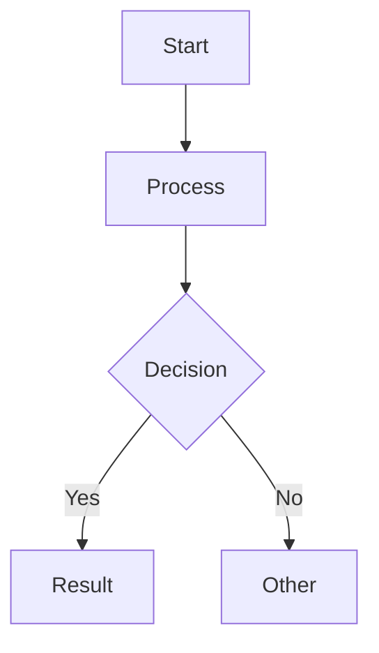

# Generate MDPT Presentation

You are generating a markdown presentation for **MDPT** (Markdown Presentation Tool built with RustPixel).

**Topic / Requirements:** $ARGUMENTS

## Output

Write the generated markdown to `gen.md` in the current working directory.

## MDPT Format Specification

### YAML Frontmatter (required at top)

```yaml
---
title: Presentation Title
author: Author Name
theme: dark
transition: cycle
title_animation: typewriter
code_theme: base16-ocean.dark
margin: 4
height: 26
transition_duration: 0.2
---
```

Available values:
- **theme**: `dark`, `light`
- **transition**: `cycle`, `fade`, `slide_left`, `slide_right`, `slide_up`, `slide_down`
- **title_animation**: `typewriter`, `spotlight`, `wave`, `fadein`
- **code_theme**: any syntect theme (`base16-ocean.dark`, `Solarized (dark)`, `InspiredGitHub`)
- **margin**: horizontal margin in cells (default 2)
- **width**: virtual canvas width in cells (default 80)
- **height**: virtual canvas height in cells (default 24, use 26-30 for dense content)

### Slide Separator

Use `---` on its own line to separate slides.

### Headings

- `# H1` — title slides and ending slides only
- `## H2` — normal slide title (most slides use this)
- `### H3` — section heading within a slide

### Lists

```markdown
* Unordered item (supports nesting with indentation)
  * Nested item
    * Deeper nesting

1. Ordered item
2. Second item
```

### Code Blocks

````markdown
```rust +line_numbers
fn main() {
    println!("Hello!");
}
```
````

Options after language name: `+line_numbers`, `+no_background`

Dynamic highlighting (press Space to cycle groups):
````markdown
```rust {1-3|5-8|all} +line_numbers
// lines 1-3 highlighted first
// then lines 5-8
// then all
```
````

### Tables

```markdown
| Header 1 | Header 2 | Header 3 |
|:---------|:--------:|---------:|
| Left     | Center   | Right    |
```

### Block Quotes and Alerts

```markdown
> Regular quote text

> [!note]
> This is a helpful note.

> [!caution]
> Be careful with this!
```

### Special MDPT Directives (HTML comments)

```markdown
<!-- pause -->              Incremental display (next content appears on key press)
<!-- divider -->             Horizontal divider line
<!-- spacer: 2 -->          Add N blank lines
<!-- jump_to_middle -->     Center next content vertically (for title/ending slides)
```

### Column Layout

```markdown
<!-- column_layout: [1, 1] -->
<!-- column: 0 -->
Left column content here
<!-- column: 1 -->
Right column content here
<!-- reset_layout -->
```

Weight ratio `[1, 1]` means equal width. Use `[2, 1]` for 2:1 ratio.

### Text Animations

```markdown
<!-- anim: spotlight -->
Text with spotlight animation (per-char highlight pulse)

<!-- anim: wave -->
Text with wave animation (sinusoidal scale)

<!-- anim: fadein -->
Text with fade-in animation (chars reveal left-to-right)

<!-- anim: typewriter -->
Text with typewriter animation (chars appear one by one)
```

### Charts (fenced code blocks)

**Line Chart:**
````markdown
```linechart
title: Monthly Revenue
x: [Jan, Feb, Mar, Apr, May]
y: [120, 200, 150, 300, 280]
y2: [80, 150, 120, 200, 250]
height: 12
```
````

**Bar Chart:**
````markdown
```barchart
title: Programming Languages
labels: [Rust, Go, Python, JS]
values: [95, 72, 88, 78]
height: 14
```
````

**Pie Chart:**
````markdown
```piechart
title: Market Share
labels: [Chrome, Safari, Firefox, Edge]
values: [65, 18, 7, 5]
radius: 20
```
````

### Mermaid Flowchart

````markdown

````

Supports `graph TD` (top-down) and `graph LR` (left-right). Node shapes: `[rect]`, `(round)`, `{diamond}`.

### Images

```markdown
<!-- image_pos: [16, 10] -->

```

Supports `.pix` and `.ssf` (sequence frame) image formats.

## Guidelines

1. Generate **18-30 slides** with rich, substantial content
2. **First slide**: title slide using `# Title` with a subtitle line
3. **Last slide**: ending slide using `<!-- jump_to_middle -->` and `# Thank You!` or similar
4. Use **varied elements**: lists, code blocks, tables, charts, columns, quotes, animations
5. Use `<!-- pause -->` for progressive reveal on content-heavy slides
6. Include at least **one code block**, **one table**, and **one chart**
7. Each slide should fit within the configured height (typically 24-30 rows minus margins)
8. If a topic has too much content for one slide, **split into multiple slides**
9. Use the language matching the topic (Chinese topic → Chinese content, English → English)
10. Use `<!-- anim: ... -->` sparingly for emphasis (1-3 times in the whole presentation)
11. Output **only** the raw markdown with YAML frontmatter, no wrapping fences
12. Read `references/examples/demo.md` first as a reference for syntax and style

## Process

1. First read `references/examples/demo.md` to understand the format in practice
2. If the user provided a document/file path, read it to extract content
3. Generate the MDPT markdown presentation
4. Write to `gen.md` in the current working directory
5. Report the number of slides generated
