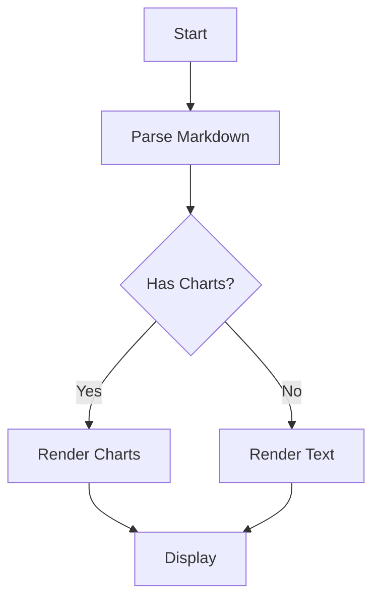

# Welcome to MDPT...

A Markdown Presentation Tool built with RustPixel

白日依山尽 黄河入海流

Press Space or Right arrow to advance

不依赖终端软件，窗口里直接跑 😀😃🍀

---

## Features

* GPU-accelerated slide transitions (6 types)
* Code syntax highlighting (100+ languages)
* Text animations (Spotlight, Wave, FadeIn, Typewriter)
* .pix/.ssf image support

<!-- pause -->

<!-- divider -->

* Column layouts
* Incremental display with pause
* Table rendering
* WASM/Web deployment
* 中文支持吗

---

## Code Highlighting

```rust +line_numbers
use rust_pixel::game::Model;

fn main() {
    let message = "Hello from MDPT!";
    println!("{}", message);

    for i in 0..5 {
        println!("  Slide {}", i);
    }
}
```

---

## Tables

| Feature       | Status   | Priority |
|:--------------|:--------:|---------:|
| Transitions   | Done     | High     |
| Highlighting  | Done     | High     |
| Column Layout | Done     | Medium   |
| Animations    | Planned  | Medium   |
| Images        | Planned  | Low      |

---

<!-- column_layout: [1, 1] -->
<!-- column: 0 -->

### Left Column

<!-- spacer: 1 -->

This demonstrates the
column layout feature.

Content flows in the
left column area.

* Item A
* Item B

<!-- column: 1 -->

### Right Column

<!-- spacer: 1 -->

The right column gets
equal width here.

Useful for comparisons
or side-by-side content.

* Item X
* Item Y

<!-- reset_layout -->

---

## Nested Lists

* RustPixel Engine
  * Rendering
    * Terminal (crossterm)
    * Graphics (wgpu/glow/sdl)
    * Web (WASM)
  * UI Framework
    * 17 widget types
    * Layout system
* MDPT Presentation
  * Markdown parsing
  * Code highlighting
  * Slide transitions

<!-- end_slide -->

## Ordered Lists

1. Parse Markdown with comrak
2. Build slide elements
3. Render with RustPixel UI
4. GPU-accelerated transitions

<!-- divider -->

Mixed with unordered:

* Unordered item A
* Unordered item B

---

## Dynamic Code Highlighting

Press Space to cycle through highlight groups:

```rust {1-4|6-10|all} +line_numbers
#[derive(Clone, Debug)]
struct Person {
    name: String,
}

impl Person {
    fn say_hello(&self) {
        println!("hello, I'm {}", self.name)
    }
}
```

---

## Code: No Background

Code can be displayed without background:

```cpp +no_background +line_numbers
// C++ example
string greet() {
    return "hi mom";
}
```

---

## Block Quotes & Alerts

> Lorem ipsum dolor sit amet. Eos laudantium animi
> ut ipsam beataeet et exercitationem deleniti.

<!-- pause -->

> [!note]
> This is a helpful note for the audience.

<!-- pause -->

> [!caution]
> Be careful with this operation!

---

## SSF Animation

> [!note]
> 按空格显示动画.

<!-- pause -->
<!-- image_pos: [16, 10] -->


---

## Text Animations

<!-- anim: spotlight -->
Spotlight: sequential per-char scale pulse

<!-- anim: wave -->
Wave: sinusoidal scale wave across characters

<!-- anim: fadein -->
FadeIn: characters reveal left-to-right with scale-up

<!-- anim: typewriter -->
Typewriter: characters appear one by one with cursor

---

## Line Chart

```linechart
title: Monthly Revenue ($K)
x: [Jan, Feb, Mar, Apr, May, Jun]
y: [120, 200, 150, 300, 280, 350]
y2: [80, 150, 120, 200, 250, 300]
height: 12
```

---

## Bar Chart

```barchart
title: Programming Languages
labels: [Rust, Go, Python, JS, Java, C++]
values: [95, 72, 88, 78, 65, 70]
height: 14
```

---

## Pie Chart

```piechart
title: Market Share
labels: [Chrome, Safari, Firefox, Edge, Other]
values: [65, 18, 7, 5, 5]
radius: 20
```

---

## Mermaid Flowchart



---

<!-- jump_to_middle -->

# Thank You!

Built with RustPixel - press q to quit
