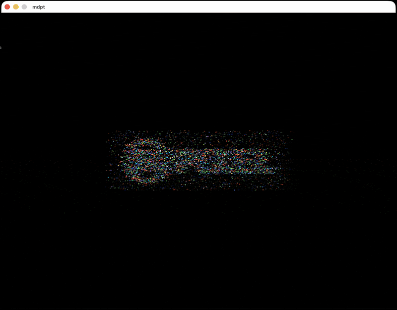
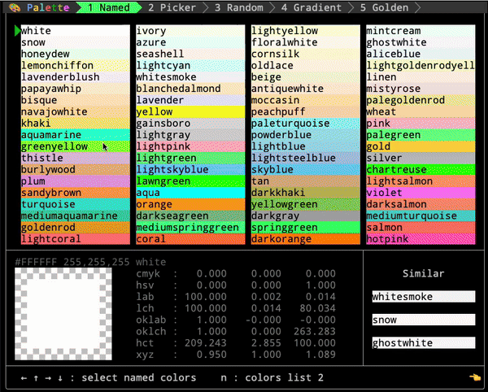
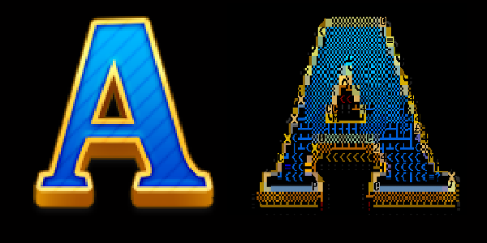
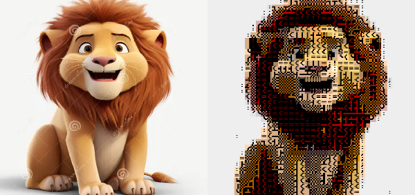

<div align="center">


![License] [![Latest Version]][crates.io] ![Downloads] [![API Documentation]][docs.rs] ![MSRV]

[License]: https://img.shields.io/badge/license-Apache2.0-blue.svg
[Latest Version]: https://img.shields.io/crates/v/rust_pixel.svg
[crates.io]: https://crates.io/crates/rust_pixel
[Downloads]: https://img.shields.io/crates/d/rust_pixel.svg
[API Documentation]: https://docs.rs/rust_pixel/badge.svg
[docs.rs]: https://docs.rs/rust_pixel
[MSRV]: https://img.shields.io/badge/rust-1.71+-brightgreen.svg?&logo=rust

**Tile-first. Retro-ready. Write Once, Run Anywhere—2D Engine!**

[Change Log] | [Architecture] | [FAQ] | [Roadmap] | [Online Demo]

[Change Log]: doc/change.md
[Architecture]: doc/architecture.md
[FAQ]: doc/faq.md
[Roadmap]: doc/roadmap_2026.md
[Online Demo]: https://zipxing.github.io/rust_pixel

</div>

---

## Core Philosophy

<table>
<tr>
<td width="33%" align="center">

### Everything is Tiles

Scene > Layer > Sprite > Buffer > Cell

Unified rendering abstraction

High performance - **One texture, one draw call** 

</td>
<td width="33%" align="center">

### Write Once, Run Anywhere

Terminal | Desktop | Web

**TUI in GPU windows — no terminal emulator**

One codebase, multiple targets

</td>
<td width="33%" align="center">

### Quick Start

`app!` macro scaffolding

**Built-in BASIC interpreter**

Model-Render-Game pattern with Event driven

</td>
</tr>
</table>

---

## ⭐ Killer App: MDPT

**A Markdown-first presentation toolkit with a self-rendered TUI(no terminal emulator needed).**

MDPT demonstrates RustPixel's unique capability: rendering a full-featured terminal UI in a native GPU window, completely independent of any terminal emulator.



```bash
cargo pixel r mdpt wg -r # WGPU mode (native)
cargo pixel r mdpt w -r # Web mode (browser)
```

### Key Features

| Feature | Description |
|---------|-------------|
| **GPU-Accelerated Transitions** | 6 transition effects (dissolve, circle, wipe, etc.) powered by shaders |
| **Code Highlighting** | 100+ languages with dynamic line-by-line reveal `{1-4\|6-10\|all}` |
| **Text Animations** | Spotlight, Wave, FadeIn, Typewriter effects |
| **Charts** | Line charts, bar charts, pie charts, Mermaid diagrams |
| **Column Layouts** | Flexible multi-column content arrangement |
| **PETSCII/SSF Images** | Native pixel-art and animation support |
| **Full CJK Support** | Chinese, Japanese, Korean text rendering |
| **MSDF Font Rendering** | [MSDF/SDF](doc/sdf.md) distance field rendering for crisp text at any scale |
| **Incremental Display** | Step-by-step content reveal with pause markers |

### Why MDPT?

Unlike terminal-based presenters (presenterm, slides), MDPT:
- **No terminal emulator** — Runs in a native window with GPU rendering
- **Consistent rendering** — Same look across all platforms
- **Rich transitions** — GPU shader effects impossible in terminals
- **True graphics** — Not limited by terminal cell constraints

### AI-Powered Slide Generation

The `gen-mdpt` Claude Code skill can automatically generate complete MDPT presentations from any topic or document — including code blocks, charts, tables, column layouts, and animations. Below is a Rust tutorial generated by `gen-mdpt`:


---

### Unified Texture Architecture

Single 4096×4096 texture (16MB VRAM), 256 blocks: Sprite(0-159), TUI(160-169), Emoji(170-175), CJK(176-239) — one texture binding, one draw call, zero texture switching.

---

## Showcase and games

PETSCII art browser built with RustPixel. Art by [@PETSCIIWORLD](https://x.com/PETSCIIWORLD), transitions by **gltransition**.

https://github.com/user-attachments/assets/4758f2b6-66c2-47ed-997d-a9066be449aa

---

## Quick Start

### Install

```bash
cargo install rust_pixel         # Install cargo-pixel CLI
cargo pixel                      # First run clones workspace to ~/rust_pixel_work
cd ~/rust_pixel_work
```

### Run Demo Games

```bash
cargo pixel r snake t            # Snake - Terminal mode
cargo pixel r snake wg           # Snake - WGPU mode (native window)
cargo pixel r tetris w           # Tetris - Web mode (localhost:8080)
cargo pixel r petview wg -r      # Petview - WGPU mode (release)
```

### Create Your Own Game

```bash
cargo pixel c mygame             # Create in ./apps/mygame
cargo pixel r mygame t           # Run it!

# Or create standalone project
cargo pixel c myapp ..           # Create in ../myapp
cd ../myapp && cargo pixel r myapp wg
```

### Write Games in BASIC

RustPixel includes **pixel_basic** - a built-in BASIC interpreter perfect for beginners or quick prototyping!

```bash
cargo pixel r basic_snake t      # Run BASIC Snake game
```

Write game logic in familiar BASIC syntax (`apps/basic_snake/assets/game.bas`):

```basic
10 REM SNAKE GAME
20 X = 20: Y = 10
30 DIM BX(100): DIM BY(100)
40 YIELD
50 GOTO 40

1000 REM ON_INIT
1010 BOX 0, 0, 60, 24, 1
1020 RETURN

2000 REM ON_TICK
2010 IF KEY("W") THEN DY = -1: DX = 0
2020 X = X + DX: Y = Y + DY
2030 RETURN

3500 REM ON_DRAW
3510 PLOT X, Y, "@", 10, 0
3520 RETURN
```

**pixel_basic** features:
- Classic BASIC syntax with line numbers
- Game hooks: `ON_INIT (1000)`, `ON_TICK (2000)`, `ON_DRAW (3500)`
- Graphics: `PLOT x, y, char, fg, bg` / `BOX` / `CLS`
- Input: `KEY("W")`, `KEY("SPACE")`
- Arrays: `DIM arr(100)`
- Control flow: `GOTO`, `GOSUB/RETURN`, `FOR/NEXT`, `IF/THEN`
- Math: `RND()`, `INT()`, `ABS()`
- Strings: `STR$()`, `LEN()`, `MID$()`

See `pixel_basic/` for the interpreter source code.

---

## Architecture

```
┌─────────────────────────────────────────────────────────┐
│                         Game                            │
│  ┌─────────────────────┐  ┌─────────────────────────┐  │
│  │       Model         │  │        Render           │  │
│  │  ├─ init()          │  │  ├─ init()              │  │
│  │  ├─ handle_input()  │  │  ├─ draw()              │  │
│  │  ├─ handle_auto()   │  │  └─ Panel               │  │
│  │  └─ handle_timer()  │  │      └─ Sprites[]       │  │
│  └─────────────────────┘  │          └─ Buffer      │  │
│                           │              └─ Cells[] │  │
│                           └─────────────────────────┘  │
└─────────────────────────────────────────────────────────┘
```

---

## Demo Games

<table>
<tr>
<td width="50%">

### Snake
PETSCII animations with smooth gameplay

```bash
cargo pixel r snake wg -r   # WGPU (native)
cargo pixel r snake t -r    # Terminal
cargo pixel r snake w -r    # Web
```


</td>
<td width="50%">

### Tetris
Play against AI

```bash
cargo pixel r tetris wg -r  # WGPU (native)
cargo pixel r tetris t -r   # Terminal
cargo pixel r tetris w -r   # Web
```


</td>
</tr>
<tr>
<td width="50%">

### Tower Defense
Pixel-perfect sprite movement

```bash
cargo pixel r tower wg -r   # WGPU (native)
cargo pixel r tower w -r    # Web
```


</td>
<td width="50%">

### Poker / Gin Rummy
Card game algorithms + FFI/WASM demos

```bash
cargo pixel r poker t -r
cargo pixel r gin_rummy t -r
```


</td>
</tr>
</table>

---

## Tools

### Palette - Color Tool
Terminal UI for color manipulation

```bash
cargo pixel r palette t -r
```



### Edit - Character Art Editor

```bash
cargo pixel e t . assets/logo.txt    # Terminal mode
cargo pixel e wg . assets/logo.pix   # WGPU mode
```

<table><tr>
<td></td>
<td></td>
</tr></table>

### Petii - Image to PETSCII Converter

```bash
cargo pixel p assets/lion.png 40 40 > lion.pix
cargo pixel e wg . lion.pix
```

<table><tr>
<td></td>
<td></td>
</tr></table>

### GIF to PETSCII Animation

```bash
cargo pixel cg input.gif output.ssf 40 25
cargo pixel ssf . output.ssf    # Preview
```

---

## FFI & WASM

RustPixel algorithms can be exported for other languages:

```bash
# C++/Python FFI
cd apps/poker/ffi && make run

# JavaScript WASM
cd apps/poker/wasm && make run
```

---

## Installation Guide

| Platform | Guide |
|----------|-------|
| macOS | [doc/mac.md](doc/mac.md) |
| Linux | [doc/linux.md](doc/linux.md) |
| Windows (WSL) | [doc/win.md](doc/win.md) |
| Windows (Native) | [doc/win-native.md](doc/win-native.md) |

**Requirements:**
- [Nerd Font](https://github.com/ryanoasis/nerd-fonts) (for terminal mode)
- Rust 1.71+
- wasm-pack (for web mode)

---

## Features

- **`app!` macro** - One-line game scaffolding with cross-platform entry points
- **Model/Render pattern** - Clean separation of logic and presentation
- **Event/Timer system** - Built-in messaging mechanism
- **Unified adapter trait** - Same code for all rendering backends
- **WGPU shaders** - Modern GPU rendering pipeline (native + WebGL2/WebGPU)
- **Game algorithms** - Pathfinding, object pools, utilities
- **Audio support** - Sound effects and music playback

---

## Roadmap

### Three Pillars

| Pillar | Description |
|--------|-------------|
| **Hybrid TUI** | Same code runs in Terminal, Native Window, and Web |
| **Scripting** | BASIC drives game logic, Rust handles engine |
| **AI Art Pipeline** | PETSCII/ASCII art search → generation |

### AI Integration

- **AI-friendly API** — Refine APIs for better AI code generation compatibility
- **AIGC for MDPT** — Auto-generate slide illustrations (converted to pixel art)
- **PETSCII/ASCII Art Generation** — Explore AI-generated low-resolution, high-quality character art

### BASIC Enhancement

- **Richer Game Capabilities** — Expand BASIC to support more complex games and TUI apps
- **Unified Script Template** — `init` / `update` / `draw` / `on_key` pattern for all apps

### Toolchain

- **Editor Improvements** — Enhanced character art editor with more features
- **Asset Pipeline** — Charset/Palette/Pack import/export, versioning, hot reload
- **Cross-Platform Consistency** — Unified input and rendering across all backends

See [Roadmap 2026](doc/roadmap_2026.md) for detailed plans.

---

<div align="center">

**Made with Rust**

</div>
