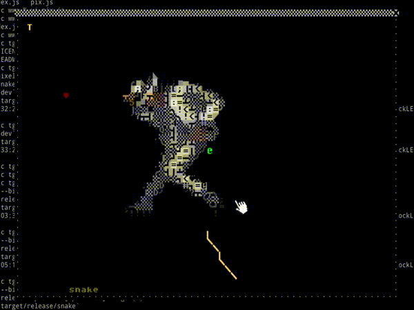
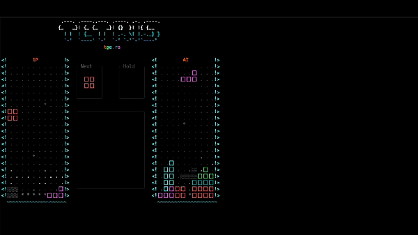
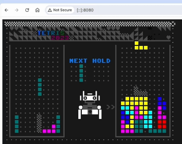
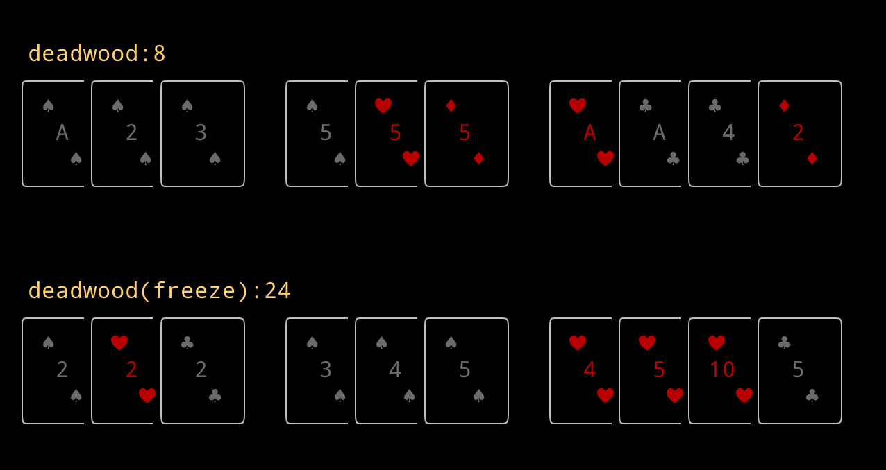
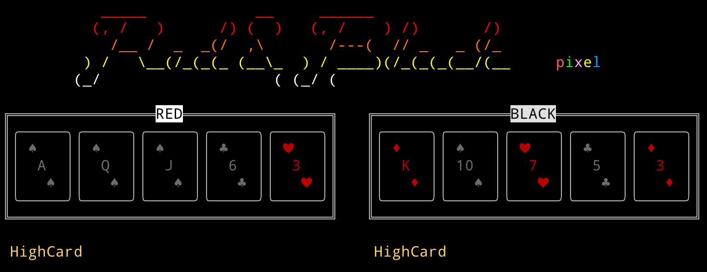

# RustPixel

#### Introduction
RustPixel is a 2D game engine written in the Rust language, supporting both text and graphical rendering modes. The text mode runs in the terminal, while the graphical mode supports both SDL standalone window mode and browser-based wasm web mode:

1. Text Mode: <br>Built with the **crossterm** module, it runs in the terminal and uses **ASCII and Unicode Emoji** for drawing.<br>
2. Graphical Mode (SDL Mode): <br>Built with **sdl2**, it runs in a standalone window and uses the **PETSCII** character set and **custom** graphical patterns for rendering.
3. Graphical Mode (Web Mode): <br>Similar to the SDL mode, but the core logic is compiled into wasm and rendered using WebGL and JavaScript (refer to rust-pixel/web-template/pix.js).

RustPixel implements game loops, a Model/Render common pattern, and a messaging mechanism to support the construction of small games. It also includes some common game algorithms and tool modules. Additionally, RustPixel comes with small games like Tetris, Tower, and Poker, which can serve as references for creating your own games and terminal applications. It also includes examples of wrapping core game algorithms into ffi and wasm.

Overall, RustPixel is suitable for creating 2D pixel-style games, rapid prototyping, and especially for developing and debugging CPU-intensive core algorithm logic. It can be compiled into ffi for game front-end and back-end use, and also into wasm for web-based small games.

#### Installation Guide
--- MacOS ---

Install brew
``` 
$ /bin/bash -c "$(curl -fsSL https://raw.githubusercontent.com/Homebrew/install/HEAD/install.sh)"
``` 

Install rust
``` 
$ curl --proto '=https' --tlsv1.2 -sSf https://sh.rustup.rs | sh
$ . "$HOME/.cargo/env"            # For sh/bash/zsh/ash/dash/pdksh
``` 

Install wasm-pack
```
curl https://rustwasm.github.io/wasm-pack/installer/init.sh -sSf | sh
```

Install Python3 (the latest macOS generally comes with it)

Install some dependent libraries and software
``` 
$ brew install ffmpeg            # Used to convert gif to ssf sequence frame files(.ssf)
$ brew install sdl2
$ brew install sdl2_image
$ brew install sdl2_gfx
$ brew install sdl2_ttf
$ brew install sdl2_mixer
``` 

Download RustPixel and deploy cargo-pixel
``` 
$ git clone https://github.com/zipxing/rust_pixel
$ cd rust_pixel
$ cp tools/cargo-pixel ~/.cargo/bin
``` 

#### Usage Instructions
--- MacOS ---
``` 
$ cd rust_pixel
$ cargo pixel run snake term            #Run the snake game in terminal mode
$ cargo pixel r snake t                 #Run the snake game in terminal mode - shorthand
$ cargo pixel r tetris s                #Run the Tetris game in SDL window mode
$ cargo pixel r tower w                 #Run tower in web,visit http://localhost:8080/ in your browser
$ cargo pixel r tower w --webport 8081  #Change web server port
$ cargo pixel r tower w -r              #Run with release mode
``` 

You can also use cargo pixel to create your own game
```
$ cargo pixel c mygame           #Create mygame using snake as a template
```

RustPixel also includes several tools:
1. tedit: Used to edit character art assets, example:
``` 
    term mode
    $ cargo pixel r tedit term assets/tmp/tedit.txt

    graphical mode
    $ cargo pixel r tedit sdl assets/tmp/tedit.pix 
```

2. tpetii: Used to convert regular images into PETSCII character art, example:
```
    $ cargo pixel r tpetii t assets/fire.png 40 40 -r > assets/fire.pix
    -r : build tpetii in release mode for high performance
```

3. Script to automatically convert gif images into PETSCII animations (ssf)
```
    $ cargo pixel cg assets/sdq/fire.gif assets/sdq/fire.ssf 40 25 
```

#### Demo games
1. snake: A snake game with a cool PETSCII animations
```
    graphical mode
    $ cargo pixel r snake s -r
```



``` 
    term mode
    $ cargo pixel r snake t -r
```

```
    web mode
    $ cargo pixel r snake w -r
    and visit http://localhost:8080/ in your browser
```

2. tetris: A Tetris game where you can play against AI
``` 
    term mode
    $ cargo pixel r tetris t -r
```

 

```
    graphical mode
    $ cargo pixel r tetris s -r
```


```
    web mode
    $ cargo pixel r tetris w -r
    and visit http://localhost:8080/ in your browser
```



3. poker: Includes the core algorithms for Texas Hold'em and Gin Rummy
``` 
    $ cargo pixel r gin_rummy t -r
    $ cargo pixel r red_black t -r
```
 
 

The poker/ffi directory demo how to wrap Rust algorithms into CFFI for use with other languages, showcasing C++ and Python calling poker_ffi
```
    $ cd games/poker/ffi
    $ make run
```
The poker/wasm directory demo how to wrap Rust algorithms into wasm for JS calling
```
    $ cd games/poker/wasm
    $ make run
```

4. tower: A tower defense game prototype demonstrating the use of objpool and pixel_sprite for pixel-perfect sprite movement
``` 
    graphical mode
    $ cargo pixel r tower s -r

    web mode
    $ cargo pixel r tower w -r
    and visit http://localhost:8080/ in your browser
```

and so on ...

