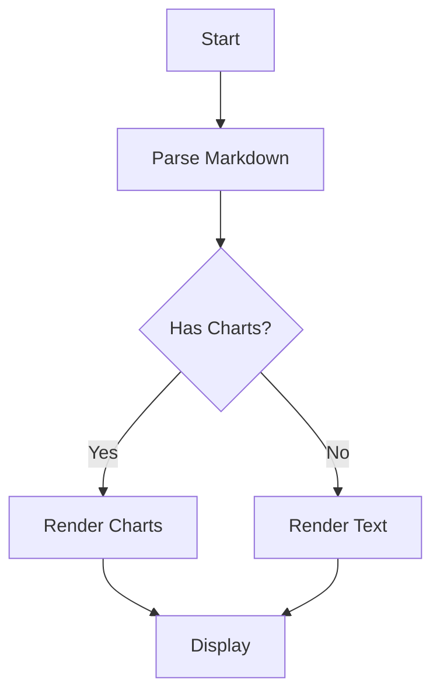
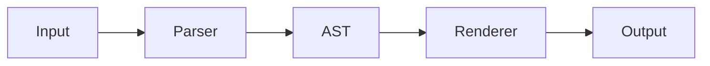

# Charts & Mermaid

Data visualization with character rendering

Press Space or Right arrow to advance

---

## Line Chart

```linechart
title: Monthly Revenue
x: [Jan, Feb, Mar, Apr, May, Jun]
y: [120, 200, 150, 300, 280, 350]
y2: [80, 150, 120, 200, 250, 300]
height: 12
```

---

## Bar Chart

```barchart
title: Programming Languages
labels: [Rust, Go, Python, JS, Java, C++]
values: [95, 72, 88, 78, 65, 70]
height: 14
```

---

## Pie Chart

```piechart
title: Market Share
labels: [Chrome, Safari, Firefox, Edge, Other]
values: [65, 18, 7, 5, 5]
radius: 7
```

---

## Mermaid Flowchart (Top-Down)



---

## Mermaid Flowchart (Left-Right)



---

## Mixed Content

Some text above the chart.

```barchart
title: Scores
labels: [Alice, Bob, Carol]
values: [92, 85, 78]
height: 10
```

And some text below.

---

# Thank You!

Charts powered by Unicode Braille & Block Elements
