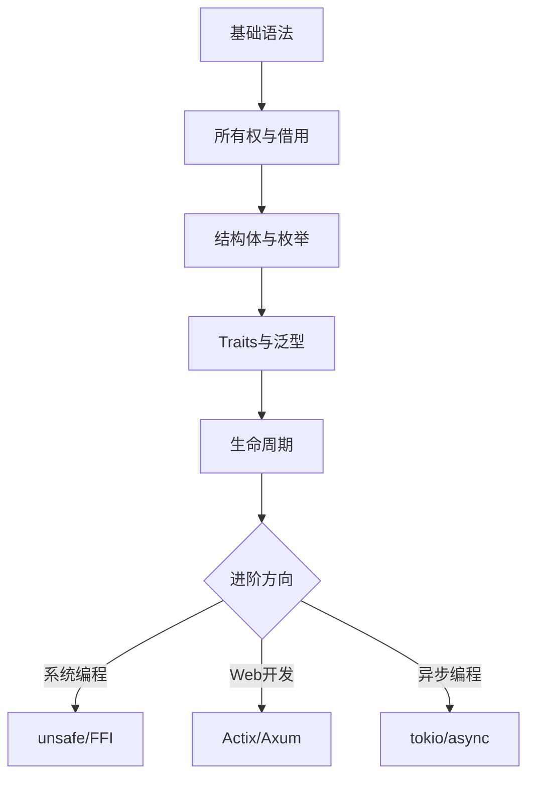

# Rust语言入门

一门系统编程语言，专注于安全、速度和并发性

按 空格 或 右箭头 翻页

---

## Rust 的优势

<!-- anim: spotlight -->
内存安全 · 高性能 · 零成本抽象

<!-- pause -->

* **内存安全:** 无需垃圾回收，通过所有权系统保证
* **高性能:** 接近 C/C++ 的执行效率
* **并发安全:** 编译期避免数据竞争
* **现代语言特性:** 模式匹配、泛型、Traits

<!-- pause -->

> [!note]
> Rust 连续多年被评为"最受喜爱的编程语言"

---

## Rust vs 其他语言

```barchart
title: 性能对比(数值越高越好)
labels: [Rust, C++, Go, Java, Python]
values: [95, 92, 72, 65, 15]
height: 12
```

---

## 安装 Rust

<!-- column_layout: [1, 1] -->
<!-- column: 0 -->

### 安装步骤

<!-- spacer: 1 -->

1. 访问 rust-lang.org
2. 安装 `rustup` 工具链管理器
3. 验证安装

```bash
curl --proto '=https' \
  --tlsv1.2 \
  -sSf https://sh.rustup.rs \
  | sh
```

<!-- column: 1 -->

### 验证安装

<!-- spacer: 1 -->

```bash
rustc --version
cargo --version
rustup --version
```

<!-- pause -->

> [!note]
> rustup 可管理多个工具链版本，
> 支持 stable/beta/nightly 切换。

<!-- reset_layout -->

---

## Hello, World!

```rust +line_numbers
fn main() {
    println!("Hello, world!");
}
```

<!-- pause -->

<!-- divider -->

编译与运行：

```bash
# 直接编译
rustc main.rs && ./main

# 使用 Cargo (推荐)
cargo new hello_rust
cd hello_rust && cargo run
```

---

## 变量与可变性

```rust {1-3|5-7|all} +line_numbers
// 不可变变量 (默认)
let x = 5;
// x = 6;  // 编译错误!

// 可变变量
let mut y = 10;
y = 20;  // OK
```

<!-- pause -->

<!-- divider -->

```rust +line_numbers
// 常量 (编译期求值, 必须标注类型)
const MAX_POINTS: u32 = 100_000;

// 变量遮蔽 (Shadowing)
let x = 5;
let x = x + 1;    // x = 6
let x = x * 2;    // x = 12
```

---

## 基本数据类型

<!-- column_layout: [1, 1] -->
<!-- column: 0 -->

### 标量类型

| 类型   | 示例            |
|:-------|:----------------|
| 整数   | `i8 ~ i128, u8 ~ u128` |
| 浮点   | `f32, f64`      |
| 布尔   | `true, false`   |
| 字符   | `'A', '中'`     |

<!-- column: 1 -->

### 复合类型

| 类型   | 示例            |
|:-------|:----------------|
| 元组   | `(i32, f64, bool)` |
| 数组   | `[i32; 5]`      |
| 切片   | `&[i32]`        |
| 字符串 | `String, &str`  |

<!-- reset_layout -->

---

## 函数与控制流

```rust +line_numbers
fn add(a: i32, b: i32) -> i32 {
    a + b  // 表达式作为返回值,无需 return
}

fn classify(n: i32) -> &'static str {
    if n > 0 { "正数" }
    else if n < 0 { "负数" }
    else { "零" }
}
```

<!-- pause -->

<!-- divider -->

```rust +line_numbers
// loop / while / for
for i in 0..5 {
    println!("{}", i);  // 0,1,2,3,4
}

let mut sum = 0;
for n in [1, 2, 3, 4, 5] {
    sum += n;
}
```

---

## 所有权 (Ownership)

<!-- anim: fadein -->
Rust 最核心的概念，保证内存安全无需 GC

<!-- pause -->

**三条规则：**

1. 每个值有且只有一个所有者
2. 同一时间只能有一个所有者
3. 所有者离开作用域时，值被释放

<!-- pause -->

```rust +line_numbers
let s1 = String::from("hello");
let s2 = s1;  // 所有权转移 (move)
// println!("{}", s1); // 编译错误!
println!("{}", s2);    // OK
```

---

## 所有权：克隆与拷贝

```rust {1-3|5-8|all} +line_numbers
// 深拷贝 (Clone)
let s1 = String::from("hello");
let s2 = s1.clone();  // s1 仍然有效

// 栈上数据自动 Copy
let x = 5;
let y = x;    // x 仍然有效
println!("x={}, y={}", x, y);
```

<!-- pause -->

> [!note]
> 实现了 Copy trait 的类型（整数、浮点、
> 布尔、字符、纯 Copy 元组）赋值时自动拷贝。

---

## 借用与引用

<!-- column_layout: [1, 1] -->
<!-- column: 0 -->

### 不可变借用 &T

```rust +line_numbers
fn len(s: &String) -> usize {
    s.len()
}

let s = String::from("hi");
let n = len(&s);
// s 仍然有效
println!("{}: {}", s, n);
```

* 可同时存在多个

<!-- column: 1 -->

### 可变借用 &mut T

```rust +line_numbers
fn push_hi(s: &mut String) {
    s.push_str(", world");
}

let mut s = String::from("hi");
push_hi(&mut s);
println!("{}", s);
// "hi, world"
```

* 同一时间只能有一个

<!-- reset_layout -->

---

## 结构体 (Struct)

```rust +line_numbers
struct User {
    name: String,
    email: String,
    active: bool,
}

impl User {
    // 关联函数 (构造器)
    fn new(name: &str, email: &str) -> Self {
        User {
            name: name.to_string(),
            email: email.to_string(),
            active: true,
        }
    }

    // 方法
    fn greet(&self) -> String {
        format!("Hi, I'm {}", self.name)
    }
}
```

---

## 枚举与模式匹配

```rust +line_numbers
enum Shape {
    Circle(f64),           // 半径
    Rectangle(f64, f64),   // 宽, 高
    Triangle(f64, f64),    // 底, 高
}

fn area(s: &Shape) -> f64 {
    match s {
        Shape::Circle(r) =>
            std::f64::consts::PI * r * r,
        Shape::Rectangle(w, h) => w * h,
        Shape::Triangle(b, h) => 0.5 * b * h,
    }
}
```

<!-- pause -->

> [!note]
> match 必须穷尽所有可能分支，编译器会检查！

---

## Option 与 Result

```rust {1-5|7-13|all} +line_numbers
// Option<T>: 处理可能为空的值
fn find_user(id: u32) -> Option<String> {
    if id == 1 { Some("Alice".into()) }
    else { None }
}

// Result<T, E>: 处理可能失败的操作
use std::fs;

fn read_config() -> Result<String, std::io::Error>
{
    fs::read_to_string("config.toml")
}
```

<!-- pause -->

<!-- divider -->

```rust +line_numbers
// ? 操作符: 简洁的错误传播
fn load() -> Result<String, std::io::Error> {
    let content = fs::read_to_string("a.txt")?;
    Ok(content.to_uppercase())
}
```

---

## Traits (特征)

<!-- anim: wave -->
Rust 中定义共享行为的方式 —— 类似接口

<!-- pause -->

```rust +line_numbers
trait Summary {
    fn summarize(&self) -> String;

    // 可提供默认实现
    fn preview(&self) -> String {
        format!("{}...", &self.summarize()[..20])
    }
}

struct Article { title: String, content: String }

impl Summary for Article {
    fn summarize(&self) -> String {
        format!("{}: {}", self.title, self.content)
    }
}
```

---

## 泛型 (Generics)

```rust +line_numbers
// 泛型函数
fn largest<T: PartialOrd>(list: &[T]) -> &T {
    let mut max = &list[0];
    for item in &list[1..] {
        if item > max { max = item; }
    }
    max
}
```

<!-- pause -->

<!-- divider -->

```rust +line_numbers
// 泛型结构体
struct Point<T> {
    x: T,
    y: T,
}

impl<T: std::fmt::Display> Point<T> {
    fn show(&self) {
        println!("({}, {})", self.x, self.y);
    }
}
```

---

## 生命周期 (Lifetimes)

```rust +line_numbers
// 生命周期注解: 告诉编译器引用的有效期
fn longest<'a>(
    x: &'a str,
    y: &'a str,
) -> &'a str {
    if x.len() > y.len() { x } else { y }
}
```

<!-- pause -->

<!-- divider -->

```rust +line_numbers
// 结构体中的生命周期
struct Excerpt<'a> {
    part: &'a str,
}

let novel = String::from("很久以前...");
let first = novel.split('.').next().unwrap();
let e = Excerpt { part: first };
```

---

## 闭包与迭代器

```rust +line_numbers
// 闭包 (Closure)
let add = |a, b| a + b;
println!("{}", add(2, 3));  // 5

// 迭代器链
let v = vec![1, 2, 3, 4, 5, 6];
let sum: i32 = v.iter()
    .filter(|&&x| x % 2 == 0)
    .map(|&x| x * x)
    .sum();
println!("{}", sum);  // 4+16+36 = 56
```

<!-- pause -->

> [!note]
> 迭代器是零成本抽象：编译后性能
> 与手写循环相同。

---

## 并发编程

```rust +line_numbers
use std::thread;
use std::sync::{Arc, Mutex};

fn main() {
    let counter = Arc::new(Mutex::new(0));
    let mut handles = vec![];

    for _ in 0..10 {
        let c = Arc::clone(&counter);
        handles.push(thread::spawn(move || {
            let mut num = c.lock().unwrap();
            *num += 1;
        }));
    }

    for h in handles { h.join().unwrap(); }
    println!("Result: {}", *counter.lock().unwrap());
}
```

---

## Cargo 与生态

| 命令             | 描述              |
|:-----------------|:------------------|
| `cargo new`      | 创建新项目        |
| `cargo build`    | 构建项目          |
| `cargo run`      | 构建并运行        |
| `cargo test`     | 运行测试          |
| `cargo doc`      | 生成文档          |
| `cargo clippy`   | 代码检查          |
| `cargo fmt`      | 代码格式化        |

<!-- pause -->

<!-- divider -->

```barchart
title: crates.io 热门领域
labels: [Web, CLI, 异步, 序列化, 数据库]
values: [85, 78, 90, 88, 72]
height: 8
```

---

## Rust 学习路径



---

<!-- jump_to_middle -->

# 谢谢观看!

<!-- anim: typewriter -->
Rust: 安全 · 高效 · 并发
