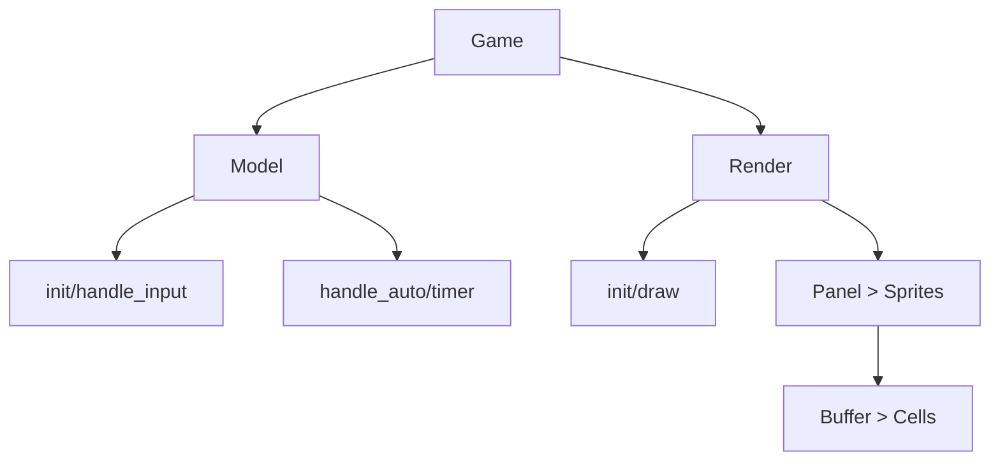
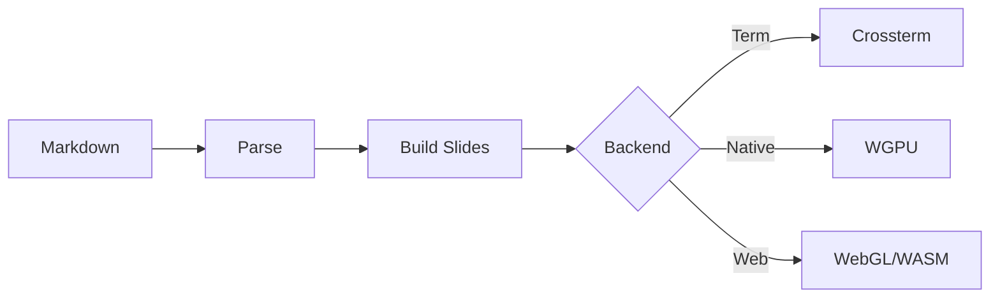

# RustPixel

Tile-first. Retro-ready. Write Once, Run Anywhere — 2D Engine!

Press Space or Right Arrow to advance

---

## Core Philosophy

<!-- anim: spotlight -->
Everything is Tiles · Write Once, Run Anywhere · Quick Start

<!-- pause -->

<!-- column_layout: [1, 1, 1] -->
<!-- column: 0 -->

### Everything is Tiles

Scene > Layer > Sprite
> Buffer > Cell

Unified rendering
abstraction

One texture,
one draw call

<!-- column: 1 -->

### Run Anywhere

Terminal | Desktop | Web

TUI in GPU windows
No terminal emulator

One codebase,
multiple targets

<!-- column: 2 -->

### Quick Start

`app!` macro scaffolding

Built-in BASIC
interpreter

Model-Render-Game
Event driven

<!-- reset_layout -->

---

## Unified Texture Architecture

Single 4096x4096 texture (16MB VRAM), 256 blocks:

| Block Range | Usage         |
|:------------|:--------------|
| 0 - 159     | Sprite        |
| 160 - 169   | TUI           |
| 170 - 175   | Emoji         |
| 176 - 239   | CJK           |

<!-- pause -->

<!-- divider -->

> [!note]
> One texture binding, one draw call, zero texture switching.
> High performance rendering for all content types.

---

## Architecture



---

## Engine Architecture Details

<!-- column_layout: [1, 1] -->
<!-- column: 0 -->

### Model (Logic)

* `init()` — Initialize game state
* `handle_input()` — Process user input
* `handle_auto()` — Auto update logic
* `handle_timer()` — Timer events

<!-- column: 1 -->

### Render (Display)

* `init()` — Setup rendering
* `draw()` — Frame rendering
* `Panel` — Container
  * `Sprites[]` — Visual elements
    * `Buffer > Cells[]`

<!-- reset_layout -->

<!-- pause -->

<!-- divider -->

> [!note]
> Clean separation of logic and presentation.
> Same pattern across all backends.

---

## Killer App: MDPT

<!-- anim: fadein -->
A Markdown Presentation Tool with self-rendered TUI

<!-- pause -->

* GPU-accelerated slide transitions (6 types)
* Code syntax highlighting (100+ languages)
* Text animations (Spotlight, Wave, FadeIn, Typewriter)
* Charts: Line, Bar, Pie, Mermaid diagrams
* Column layouts & Incremental display
* PETSCII/SSF image & animation support
* Full CJK support & MSDF font rendering

---

## MDPT vs Terminal Presenters

| Feature             | MDPT     | Terminal |
|:--------------------|:--------:|:--------:|
| GPU Rendering       | Yes      | No       |
| Shader Transitions  | Yes      | No       |
| Consistent Look     | Yes      | Varies   |
| True Graphics       | Yes      | Limited  |
| No Terminal Needed  | Yes      | No       |

<!-- pause -->

```bash
# Run MDPT
cargo pixel r mdpt wg -r  # Native
cargo pixel r mdpt w -r    # Web
```

---

## Quick Start: Install

```bash +line_numbers
# Install cargo-pixel CLI
cargo install rust_pixel

# First run clones workspace
cargo pixel
cd ~/rust_pixel_work
```

<!-- pause -->

<!-- divider -->

### System Requirements

* Rust 1.71+
* Nerd Font (for terminal mode)
* wasm-pack (for web mode)

---

## Quick Start: Run Games

```bash {1-2|3-4|5-6|all} +line_numbers
# Snake - Terminal mode
cargo pixel r snake t
# Snake - WGPU mode (native window)
cargo pixel r snake wg
# Tetris - Web mode
cargo pixel r tetris w
```

<!-- pause -->

<!-- divider -->

### Create Your Own Game

```bash +line_numbers
cargo pixel c mygame        # Create project
cargo pixel r mygame t      # Run it!
```

---

## Demo Games

<!-- column_layout: [1, 1] -->
<!-- column: 0 -->

### Snake

PETSCII animations with
smooth gameplay

```bash
cargo pixel r snake wg -r
cargo pixel r snake t -r
cargo pixel r snake w -r
```

<!-- pause -->

### Tower Defense

Pixel-perfect sprite movement

```bash
cargo pixel r tower wg -r
```

<!-- column: 1 -->

### Tetris

Play against AI

```bash
cargo pixel r tetris wg -r
cargo pixel r tetris t -r
cargo pixel r tetris w -r
```

<!-- pause -->

### Poker / Gin Rummy

Card game algorithms

```bash
cargo pixel r poker t -r
cargo pixel r gin_rummy t -r
```

<!-- reset_layout -->

---

## Demo Games Popularity

```barchart
title: Game Complexity Score
labels: [Snake, Tetris, Tower, Poker, GinRummy]
values: [60, 75, 85, 70, 80]
height: 12
```

---

## Built-in BASIC Interpreter

<!-- anim: wave -->
pixel_basic: Write game logic in familiar BASIC syntax!

<!-- pause -->

```basic +line_numbers
10 REM SNAKE GAME
20 X = 20: Y = 10
30 DIM BX(100): DIM BY(100)
40 YIELD
50 GOTO 40

1000 REM ON_INIT
1010 BOX 0, 0, 60, 24, 1
1020 RETURN

2000 REM ON_TICK
2010 IF KEY("W") THEN DY = -1: DX = 0
2020 X = X + DX: Y = Y + DY
2030 RETURN
```

---

## pixel_basic Features

<!-- column_layout: [1, 1] -->
<!-- column: 0 -->

### Game Hooks

| Hook      | Line   |
|:----------|:-------|
| ON_INIT   | 1000   |
| ON_TICK   | 2000   |
| ON_DRAW   | 3500   |

### Graphics

* `PLOT x, y, char, fg, bg`
* `BOX x, y, w, h, style`
* `CLS` — clear screen

<!-- column: 1 -->

### Language Features

* Classic line-number syntax
* `GOTO` / `GOSUB` / `RETURN`
* `FOR` / `NEXT` loops
* `IF` / `THEN` conditions
* `DIM arr(100)` — arrays

### Built-in Functions

* `KEY("W")` / `KEY("SPACE")`
* `RND()` / `INT()` / `ABS()`
* `STR$()` / `LEN()` / `MID$()`

<!-- reset_layout -->

---

## Tools: Palette & Editor

<!-- column_layout: [1, 1] -->
<!-- column: 0 -->

### Palette

Terminal UI color tool

```bash
cargo pixel r palette t -r
```

Manipulate and preview
terminal color schemes.

<!-- column: 1 -->

### Edit

Character art editor

```bash
# Terminal mode
cargo pixel e t . logo.txt
# WGPU mode
cargo pixel e wg . logo.pix
```

Edit PETSCII pixel art
in any backend.

<!-- reset_layout -->

---

## Tools: Petii & GIF Converter

### Image to PETSCII

```bash +line_numbers
# Convert image to PETSCII art
cargo pixel p assets/lion.png 40 40 > lion.pix

# Preview the result
cargo pixel e wg . lion.pix
```

<!-- pause -->

<!-- divider -->

### GIF to PETSCII Animation

```bash +line_numbers
# Convert GIF to SSF animation
cargo pixel cg input.gif output.ssf 40 25

# Preview animation
cargo pixel ssf . output.ssf
```

---

## FFI & WASM

RustPixel algorithms can be exported for other languages:

```bash +line_numbers
# C++/Python FFI
cd apps/poker/ffi && make run

# JavaScript WASM
cd apps/poker/wasm && make run
```

<!-- pause -->

<!-- divider -->

```linechart
title: Cross-language Performance Ratio
x: [Rust, C++ FFI, Python FFI, JS WASM]
y: [100, 95, 30, 75]
height: 8
```

---

## Engine Features

| Feature              | Description                      |
|:---------------------|:---------------------------------|
| `app!` macro         | One-line game scaffolding        |
| Model/Render         | Logic & presentation separation  |
| Event/Timer          | Built-in messaging mechanism     |
| Adapter trait        | Same code for all backends       |
| WGPU shaders         | Modern GPU pipeline              |
| Game algorithms      | Pathfinding, object pools        |
| Audio support        | Sound effects & music            |

---

## Rendering Pipeline



---

## Roadmap: Three Pillars

<!-- column_layout: [1, 1, 1] -->
<!-- column: 0 -->

### Hybrid TUI

Same code runs in:
* Terminal
* Native Window
* Web Browser

<!-- column: 1 -->

### Scripting

BASIC drives game logic

Rust handles engine

Unified script template

<!-- column: 2 -->

### AI Art Pipeline

PETSCII/ASCII art
search & generation

AIGC for MDPT slides

AI-friendly API

<!-- reset_layout -->

---

## Roadmap: Details

```barchart
title: Development Priority
labels: [Hybrid TUI, Scripting, AI Art, Toolchain, Editor]
values: [90, 80, 75, 70, 65]
height: 10
```

<!-- pause -->

* **BASIC Enhancement** — Richer game capabilities, unified templates
* **Toolchain** — Asset pipeline, hot reload, cross-platform consistency
* **AI Integration** — Auto-generate illustrations, PETSCII art generation

---

## Platform Support

| Platform         | Terminal | WGPU   | Web    |
|:-----------------|:--------:|:------:|:------:|
| macOS            | Yes      | Yes    | Yes    |
| Linux            | Yes      | Yes    | Yes    |
| Windows (WSL)    | Yes      | Yes    | Yes    |
| Windows (Native) | Yes      | Yes    | Yes    |

<!-- pause -->

> [!note]
> All platforms share the same codebase.
> cargo-pixel CLI handles all build targets.

---

<!-- jump_to_middle -->

# Thank You!

<!-- anim: typewriter -->
RustPixel: Tile-first, Retro-ready, Run Anywhere
