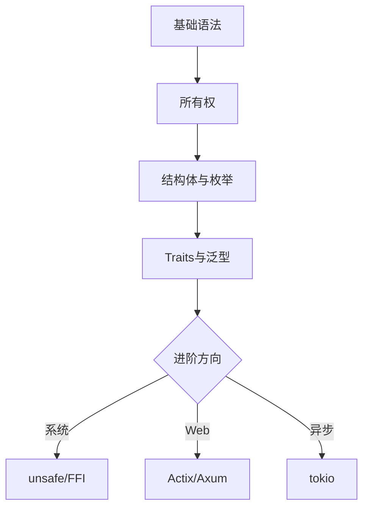

# Rust 语言教程

一门系统编程语言，专注于安全、速度和并发性

按 空格 或 右箭头 翻页

---

## 为什么选择 Rust？

<!-- anim: spotlight -->
内存安全 · 高性能 · 零成本抽象

<!-- pause -->

* **内存安全:** 无需垃圾回收，编译期所有权系统保证
* **高性能:** 接近 C/C++ 的执行效率，无运行时开销
* **并发安全:** 编译期消除数据竞争
* **现代语言:** 模式匹配、泛型、Traits、宏系统

<!-- pause -->

> [!note]
> Rust 连续多年被评为"最受喜爱的编程语言"。
> 被 Linux、Windows、Android 等内核项目采用。

---

## Rust vs 其他语言

```barchart
title: 综合评分 (安全+性能+生态)
labels: [Rust, C++, Go, Java, Python]
values: [95, 78, 82, 75, 68]
height: 12
```

---

## 安装 Rust

<!-- column_layout: [1, 1] -->
<!-- column: 0 -->

### 安装步骤

<!-- spacer: 1 -->

1. 安装 `rustup` 工具链管理器
2. 验证安装
3. 配置编辑器

```bash
curl --proto '=https' \
  --tlsv1.2 \
  -sSf https://sh.rustup.rs \
  | sh
```

<!-- column: 1 -->

### 验证与配置

<!-- spacer: 1 -->

```bash
rustc --version
cargo --version
rustup --version
```

<!-- pause -->

> [!note]
> rustup 可管理多个工具链版本，
> 支持 stable/beta/nightly 切换。

<!-- reset_layout -->

---

## Hello, World!

```rust +line_numbers
fn main() {
    println!("Hello, world!");
}
```

<!-- pause -->

<!-- divider -->

编译与运行：

```bash
# 直接编译
rustc main.rs && ./main

# 使用 Cargo (推荐)
cargo new hello_rust
cd hello_rust && cargo run
```

---

## 变量与可变性

```rust {1-3|5-7|all} +line_numbers
// 不可变变量 (默认)
let x = 5;
// x = 6;  // 编译错误!

// 可变变量
let mut y = 10;
y = 20;  // OK
```

<!-- pause -->

<!-- divider -->

```rust +line_numbers
// 常量 (编译期求值, 必须标注类型)
const MAX_POINTS: u32 = 100_000;

// 变量遮蔽 (Shadowing)
let x = 5;
let x = x + 1;    // x = 6
let x = x * 2;    // x = 12
```

---

## 基本数据类型

<!-- column_layout: [1, 1] -->
<!-- column: 0 -->

### 标量类型

| 类型   | 示例              |
|:-------|:------------------|
| 整数   | `i8 ~ i128`       |
| 无符号 | `u8 ~ u128`       |
| 浮点   | `f32, f64`        |
| 布尔   | `true, false`     |
| 字符   | `'A', '中'`       |

<!-- column: 1 -->

### 复合类型

| 类型   | 示例              |
|:-------|:------------------|
| 元组   | `(i32, f64, bool)`|
| 数组   | `[i32; 5]`        |
| 切片   | `&[i32]`          |
| 字符串 | `String, &str`    |

<!-- reset_layout -->

---

## 函数定义

```rust +line_numbers
// 参数须标注类型,返回值用 -> 声明
fn add(a: i32, b: i32) -> i32 {
    a + b  // 最后一个表达式作为返回值
}

// if 是表达式,可直接返回值
fn classify(n: i32) -> &'static str {
    if n > 0 { "正数" }
    else if n < 0 { "负数" }
    else { "零" }
}
```

<!-- pause -->

> [!note]
> Rust 中几乎一切都是表达式。
> if、match、块 `{}` 都能返回值。

---

## 控制流

```rust {1-4|6-10|12-16|all} +line_numbers
// for 循环 (最常用)
for i in 0..5 {
    println!("{}", i);  // 0,1,2,3,4
}

// while 循环
let mut n = 3;
while n > 0 {
    n -= 1;
}

// loop: 无限循环，可用 break 返回值
let result = loop {
    if n == 10 { break n * 2; }
    n += 1;
};
```

---

## 所有权 (Ownership)

<!-- anim: fadein -->
Rust 最核心的概念 —— 保证内存安全无需 GC

<!-- pause -->

**三条规则：**

1. 每个值有且只有一个所有者
2. 同一时间只能有一个所有者
3. 所有者离开作用域时，值被自动释放

<!-- pause -->

```rust +line_numbers
let s1 = String::from("hello");
let s2 = s1;  // 所有权转移 (move)
// println!("{}", s1); // 编译错误!
println!("{}", s2);    // OK
```

---

## 克隆与拷贝

```rust {1-3|5-8|all} +line_numbers
// 深拷贝 (Clone) - 堆数据
let s1 = String::from("hello");
let s2 = s1.clone();  // s1 仍然有效

// 栈上数据自动拷贝 (Copy trait)
let x = 5;
let y = x;    // x 仍然有效
println!("x={}, y={}", x, y);
```

<!-- pause -->

> [!note]
> 实现了 Copy trait 的类型（整数、浮点、
> 布尔、字符、纯 Copy 元组）赋值时自动拷贝。
> String、Vec 等堆数据类型不实现 Copy。

---

## 借用与引用

<!-- column_layout: [1, 1] -->
<!-- column: 0 -->

### 不可变借用 &T

```rust +line_numbers
fn len(s: &String) -> usize {
    s.len()
}

let s = String::from("hi");
let n = len(&s);
// s 仍然有效
println!("{}: {}", s, n);
```

* 可同时存在多个

<!-- column: 1 -->

### 可变借用 &mut T

```rust +line_numbers
fn push(s: &mut String) {
    s.push_str(" world");
}

let mut s = String::from("hi");
push(&mut s);
println!("{}", s);
// "hi world"
```

* 同一时间只能有一个

<!-- reset_layout -->

---

## 借用规则总结

* 同一时间，要么有 **多个不可变引用**，
  要么有 **一个可变引用**，不能同时存在
* 引用必须始终有效 (不能悬垂)

<!-- pause -->

```rust +line_numbers
let mut s = String::from("hello");

let r1 = &s;       // OK
let r2 = &s;       // OK: 多个不可变引用
println!("{} {}", r1, r2);
// r1, r2 此后不再使用

let r3 = &mut s;   // OK: 不可变引用已结束
r3.push_str("!");
```

<!-- pause -->

> [!caution]
> 违反借用规则会导致编译错误，而非运行时崩溃。

---

## 结构体 (Struct)

```rust +line_numbers
struct User {
    name: String,
    email: String,
    active: bool,
}

impl User {
    fn new(name: &str, email: &str) -> Self {
        User {
            name: name.to_string(),
            email: email.to_string(),
            active: true,
        }
    }

    fn greet(&self) -> String {
        format!("Hi, I'm {}", self.name)
    }
}
```

---

## 枚举与模式匹配

```rust +line_numbers
enum Shape {
    Circle(f64),
    Rectangle(f64, f64),
    Triangle(f64, f64),
}

fn area(s: &Shape) -> f64 {
    match s {
        Shape::Circle(r) =>
            std::f64::consts::PI * r * r,
        Shape::Rectangle(w, h) => w * h,
        Shape::Triangle(b, h) => 0.5 * b * h,
    }
}
```

<!-- pause -->

> [!note]
> match 必须穷尽所有分支，编译器强制检查！
> 可用 `_` 通配符匹配其他情况。

---

## Option 与 Result

```rust {1-5|7-12|all} +line_numbers
// Option<T>: 处理可能为空的值
fn find(id: u32) -> Option<String> {
    if id == 1 { Some("Alice".into()) }
    else { None }
}

// Result<T, E>: 处理可能失败的操作
use std::fs;

fn read_cfg() -> Result<String, std::io::Error> {
    fs::read_to_string("config.toml")
}
```

<!-- pause -->

<!-- divider -->

```rust +line_numbers
// ? 操作符: 简洁的错误传播
fn load() -> Result<String, std::io::Error> {
    let s = fs::read_to_string("a.txt")?;
    Ok(s.to_uppercase())
}
```

---

## Traits (特征)

<!-- anim: wave -->
定义共享行为 —— Rust 的多态基础

<!-- pause -->

```rust +line_numbers
trait Summary {
    fn summarize(&self) -> String;

    // 可提供默认实现
    fn preview(&self) -> String {
        format!("{}...", &self.summarize()[..20])
    }
}

struct Article { title: String, body: String }

impl Summary for Article {
    fn summarize(&self) -> String {
        format!("{}: {}", self.title, self.body)
    }
}
```

---

## 泛型 (Generics)

```rust +line_numbers
// 泛型函数
fn largest<T: PartialOrd>(list: &[T]) -> &T {
    let mut max = &list[0];
    for item in &list[1..] {
        if item > max { max = item; }
    }
    max
}
```

<!-- pause -->

<!-- divider -->

```rust +line_numbers
// 泛型结构体 + Trait 约束
struct Point<T> { x: T, y: T }

impl<T: std::fmt::Display> Point<T> {
    fn show(&self) {
        println!("({}, {})", self.x, self.y);
    }
}
```

---

## 生命周期 (Lifetimes)

```rust +line_numbers
// 生命周期注解: 告诉编译器引用的有效期
fn longest<'a>(
    x: &'a str,
    y: &'a str,
) -> &'a str {
    if x.len() > y.len() { x } else { y }
}
```

<!-- pause -->

<!-- divider -->

```rust +line_numbers
// 结构体中持有引用必须标注生命周期
struct Excerpt<'a> {
    part: &'a str,
}

let novel = String::from("很久以前...");
let first = novel.split('.').next().unwrap();
let e = Excerpt { part: first };
```

---

## 闭包 (Closures)

```rust +line_numbers
// 闭包: 可捕获环境变量的匿名函数
let add = |a, b| a + b;
println!("{}", add(2, 3));  // 5

// 捕获外部变量
let name = String::from("Rust");
let greet = move || {
    println!("Hello, {}!", name);
};
greet();
// name 已被 move 进闭包，不再可用
```

<!-- pause -->

> [!note]
> 闭包有三种捕获方式：
> `Fn` (不可变借用)、`FnMut` (可变借用)、
> `FnOnce` (获取所有权)

---

## 迭代器

```rust +line_numbers
let v = vec![1, 2, 3, 4, 5, 6];

// 迭代器链: 惰性求值，组合式处理
let sum: i32 = v.iter()
    .filter(|&&x| x % 2 == 0)  // 偶数
    .map(|&x| x * x)           // 平方
    .sum();                     // 求和
println!("{}", sum);  // 4+16+36 = 56
```

<!-- pause -->

<!-- divider -->

```rust +line_numbers
// 常用迭代器方法
let names = vec!["Alice", "Bob", "Charlie"];
let result: Vec<String> = names.iter()
    .enumerate()
    .map(|(i, n)| format!("{}. {}", i+1, n))
    .collect();
```

---

## 集合类型

<!-- column_layout: [1, 1] -->
<!-- column: 0 -->

### Vec<T> 动态数组

```rust +line_numbers
let mut v = vec![1, 2, 3];
v.push(4);
v.pop();

for i in &v {
    println!("{}", i);
}
```

### String 字符串

```rust +line_numbers
let mut s = String::new();
s.push_str("hello");
s.push(' ');
s += "world";
```

<!-- column: 1 -->

### HashMap 哈希表

```rust +line_numbers
use std::collections::HashMap;

let mut map = HashMap::new();
map.insert("key", 42);

if let Some(v) = map.get("key")
{
    println!("{}", v);
}

// entry API
map.entry("new")
    .or_insert(0);
```

<!-- reset_layout -->

---

## 并发编程

```rust +line_numbers
use std::thread;
use std::sync::{Arc, Mutex};

fn main() {
    let counter = Arc::new(Mutex::new(0));
    let mut handles = vec![];

    for _ in 0..10 {
        let c = Arc::clone(&counter);
        handles.push(thread::spawn(move || {
            *c.lock().unwrap() += 1;
        }));
    }

    for h in handles { h.join().unwrap(); }
    println!("{}", *counter.lock().unwrap());
}
```

---

## 智能指针

| 类型          | 用途                    |
|:--------------|:------------------------|
| `Box<T>`      | 堆上分配，单一所有者    |
| `Rc<T>`       | 引用计数，多个所有者    |
| `Arc<T>`      | 原子引用计数，跨线程    |
| `RefCell<T>`  | 运行时借用检查          |
| `Mutex<T>`    | 互斥锁，线程安全        |

<!-- pause -->

```rust +line_numbers
use std::rc::Rc;

let a = Rc::new(vec![1, 2, 3]);
let b = Rc::clone(&a);  // 引用计数 +1
println!("count = {}", Rc::strong_count(&a));
// count = 2
```

---

## 宏系统

```rust {1-6|8-14|all} +line_numbers
// 声明式宏 (macro_rules!)
macro_rules! say_hello {
    () => { println!("Hello!") };
    ($name:expr) => {
        println!("Hello, {}!", $name)
    };
}

// 常见标准库宏
vec![1, 2, 3];           // 创建 Vec
println!("{:?}", data);  // 格式化打印
format!("x = {}", 42);  // 格式化字符串
todo!();                 // 标记待完成
unreachable!();          // 标记不可达
```

---

## Cargo

| 命令            | 描述           |
|:----------------|:---------------|
| `cargo new`     | 创建新项目     |
| `cargo build`   | 构建项目       |
| `cargo run`     | 构建并运行     |
| `cargo test`    | 运行测试       |
| `cargo doc`     | 生成文档       |
| `cargo clippy`  | 代码检查       |
| `cargo fmt`     | 代码格式化     |

---

## crates.io 生态

```barchart
title: crates.io 热门领域
labels: [Web, CLI, 异步, 序列化, 数据库, 游戏]
values: [85, 78, 90, 88, 72, 65]
height: 16
```

---

## 学习路径



---

<!-- jump_to_middle -->

# 谢谢观看!

<!-- anim: typewriter -->
Rust: 安全 · 高效 · 并发
