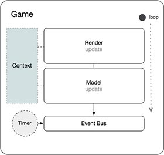
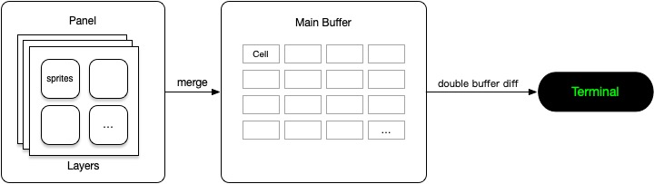
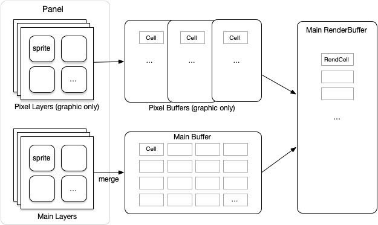
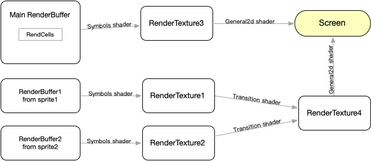

### gameloop



- In each frame, the `update` methods of both `model` and `render` are executed alternately.
- Modules can communicate and decouple through a messaging mechanism.
- A timer module is built into the message bus.
- The `model` manages game state data and logic, while the `render` mechanism is explained in detail below.

<br>

### text mode render



- The rendering process in text mode is relatively simple.
- A `Panel` contains several layers (sprite collections).
- All sprites from these layers are merged into the main buffer.
- After the double-buffering comparison, the changed content is drawn to the terminal using `crossterm`.

```
// Panel struct...
pub struct Panel {
    // double buffers...
    pub buffers: [Buffer; 2],
    pub current: usize,
    pub layers: Vec<Sprites>,
    // layer name, layer index...
    pub layer_tag_index: HashMap<String, usize>,
    // layer index, render weight...
    pub render_index: Vec<(usize, i32)>,
}

// Sprites(Layer) struct...
pub struct Sprites {
    pub name: String,
    pub is_pixel: bool,
    pub is_hidden: bool,
    pub sprites: Vec<Sprite>,
    // sprite name : sprite index
    pub tag_index: HashMap<String, usize>,
    // sprite index : render weight...
    pub render_index: Vec<(usize, i32)>,
    // render weight as layers in panel...
    pub render_weight: i32,
}

// Sprite struct...
pub struct Sprite {
    pub content: Buffer,
    pub angle: f64,
    pub alpha: u8,
    // asset request record for async asset loading...
    pub asset_request: Option<(AssetType, String, usize, u16, u16)>,
    // render weight in layer(sprites)
    render_weight: i32,
}

// Buffer struct...
pub struct Buffer {
    pub area: Rect,
    pub content: Vec<Cell>,
}

// Cell struct...
pub struct Cell {
    pub symbol: String,
    pub fg: Color,
    pub bg: Color,
    pub modifier: Modifier,
    // tex id in graphics mode...
    pub tex: u8,
}
```

<br>

### graphics mode render pass 1



- In graphics mode, rendering supports Pixel Layers in addition to regular sprite collections.
- Pixel Layers manage Pixel Sprites, which differ from regular sprites by being able to move at the pixel level.
- In graphics mode, regular sprites are also merged into the main buffer and can be used to display background elements.
- Pixel Sprites are rendered separately and support transparency.
- Each Pixel Sprite's buffer, along with the main buffer, is appended to the `RenderBuffer`.
- Each element of the `RenderBuffer` is a `RenderCell`.

```
// RenderCell struct...
pub struct RenderCell {
    pub fcolor: (f32, f32, f32, f32),
    pub bcolor: Option<(f32, f32, f32, f32)>,
    pub texsym: usize,
    pub x: f32,
    pub y: f32,
    pub w: u32,
    pub h: u32,
    pub angle: f32,
    // center point xy
    pub cx: f32,
    pub cy: f32,
}

// RenderBuffer is Vec<RenderCell>

```

<br>

### graphics mode render pass 2



- You can use the built-in `symbols shader` to draw the RenderBuffer into a render texture
- The `symbols shader` uses OpenGL instanced rendering technology to achieve high performance
- The built-in `transition shader` can mix and draw two render textures into another render texture according to a certain algorithm to achieve the transition effect.
- The built-in `general2d shader` can draw any render texture to the screen
- You can use the GlRender trait to implement your own shader to achieve flexible special effects

```
// refer to render/adapter/gl.rs
pub trait GlRender {
    fn new(canvas_width: u32, canvas_height: u32) -> Self
    where
        Self: Sized;
    fn get_base(&mut self) -> &mut GlRenderBase;
    fn create_shader(
        &mut self,
        gl: &glow::Context,
        ver: &str,
    );
    fn create_buffer(&mut self, gl: &glow::Context);
    fn init(&mut self, gl: &glow::Context, ver: &str) {
        self.create_shader(gl, ver);
        self.create_buffer(gl);
    }
    fn prepare_draw(&mut self, gl: &glow::Context);
    fn draw(&mut self, gl: &glow::Context);
    fn cleanup(&mut self, gl: &glow::Context);
}
pub struct GlRenderBase {
    pub id: usize,
    pub shader: Vec<GlShader>,
    pub shader_binded: bool,
    pub vao: Option<glow::VertexArray>,
    pub gl_buffers: Vec<glow::Buffer>,
    pub textures: Vec<glow::Texture>,
    pub textures_binded: bool,
    pub canvas_width: u32,
    pub canvas_height: u32,
}

// refer to render/adapter/gl/render_symbols.rs render_transition.rs render_general2d.rs 
...

```

<br>

