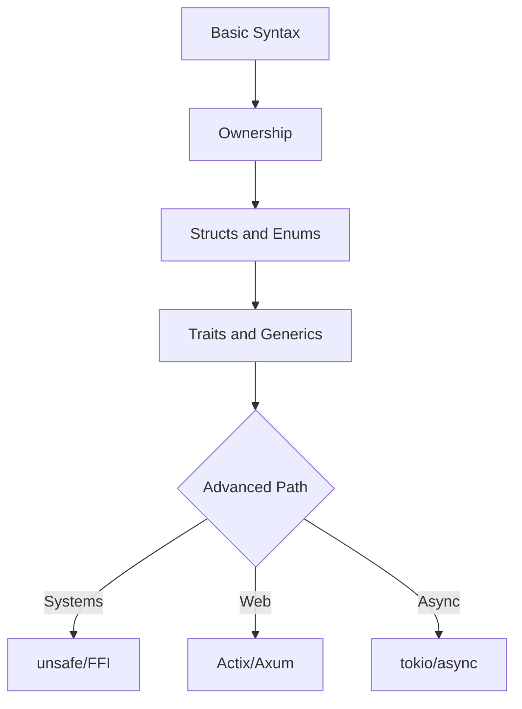
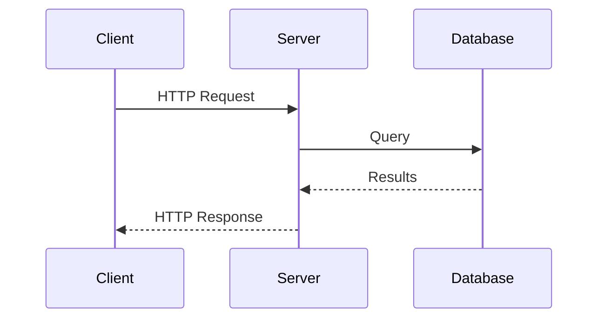

# The Rust Programming Language

A systems language focused on safety, speed, and concurrency

Press Space or Right Arrow to advance

---

## Why Rust?

<!-- anim: spotlight -->
Memory Safety - Performance - Zero-Cost Abstractions

<!-- pause -->

* **Memory safe** without garbage collection (ownership system)
* **Performance** on par with C/C++, no runtime overhead
* **Concurrency** without data races (compile-time guarantees)
* **Modern tooling:** Cargo, rustfmt, clippy, rust-analyzer

<!-- pause -->

> [!note]
> Rust has been voted "most admired language" for years.
> Adopted by Linux, Windows, Android, and Chromium kernels.

---

## Rust vs Other Languages

```barchart
title: Overall Score (Safety+Perf+Ecosystem)
labels: [Rust, C++, Go, Java, Python, Zig]
values: [95, 78, 82, 75, 68, 80]
height: 12
```

---

## Installation

<!-- column_layout: [1, 1] -->
<!-- column: 0 -->

### Install rustup

```bash
curl --proto '=https' \
  --tlsv1.2 -sSf \
  https://sh.rustup.rs | sh
```

<!-- column: 1 -->

### Verify

```bash
rustc --version
cargo --version
rustup --version
```

<!-- reset_layout -->

<!-- pause -->

> [!note]
> rustup manages multiple toolchains.
> Switch between stable, beta, and nightly easily.

---

## Hello, World!

```rust +line_numbers
fn main() {
    println!("Hello, world!");
}
```

<!-- pause -->

<!-- divider -->

Build and run:

```bash +line_numbers
# Compile directly
rustc main.rs && ./main

# Using Cargo (recommended)
cargo new hello_rust
cd hello_rust && cargo run
```

---

## Variables and Mutability

```rust {1-3|5-7|all} +line_numbers
// Immutable by default
let x = 5;
// x = 6;  // ERROR: cannot assign twice

// Mutable variables
let mut y = 10;
y = 20;  // OK
```

<!-- pause -->

<!-- divider -->

```rust +line_numbers
// Constants (compile-time, type annotation required)
const MAX_POINTS: u32 = 100_000;

// Shadowing (re-declare with let)
let x = 5;
let x = x + 1;    // x = 6
let x = x * 2;    // x = 12
```

---

## Primitive Data Types

<!-- column_layout: [1, 1] -->
<!-- column: 0 -->

### Scalar Types

| Type    | Examples          |
|:--------|:------------------|
| Integer | `i8` to `i128`    |
| Unsigned| `u8` to `u128`    |
| Float   | `f32, f64`        |
| Boolean | `true, false`     |
| Char    | `'A', 'Z'`       |

<!-- column: 1 -->

### Compound Types

| Type    | Examples          |
|:--------|:------------------|
| Tuple   | `(i32, f64, bool)`|
| Array   | `[i32; 5]`        |
| Slice   | `&[i32]`          |
| String  | `String, &str`    |

<!-- reset_layout -->

---

## Functions

```rust +line_numbers
// Parameters require type annotations
// Return type declared with ->
fn add(a: i32, b: i32) -> i32 {
    a + b  // last expression = return value
}

// if is an expression (returns a value)
fn classify(n: i32) -> &'static str {
    if n > 0 { "positive" }
    else if n < 0 { "negative" }
    else { "zero" }
}
```

<!-- pause -->

> [!note]
> Almost everything in Rust is an expression.
> if, match, and blocks {} can all return values.

---

## Control Flow

```rust {1-4|6-10|12-16|all} +line_numbers
// for loop (most common)
for i in 0..5 {
    println!("{}", i);  // 0,1,2,3,4
}

// while loop
let mut n = 3;
while n > 0 {
    n -= 1;
}

// loop: infinite, break returns a value
let result = loop {
    if n == 10 { break n * 2; }
    n += 1;
};
```

---

## Ownership

<!-- anim: fadein -->
The core concept that guarantees memory safety without GC

<!-- pause -->

**Three rules:**

1. Each value has exactly one owner
2. There can only be one owner at a time
3. When the owner goes out of scope, the value is dropped

<!-- pause -->

```rust +line_numbers
let s1 = String::from("hello");
let s2 = s1;  // ownership MOVED to s2
// println!("{}", s1); // ERROR: s1 is invalid
println!("{}", s2);    // OK
```

---

## Clone and Copy

```rust {1-3|5-8|all} +line_numbers
// Deep copy (Clone) - heap data
let s1 = String::from("hello");
let s2 = s1.clone();  // s1 still valid

// Stack data: automatic Copy
let x = 5;
let y = x;    // x still valid
println!("x={}, y={}", x, y);
```

<!-- pause -->

> [!note]
> Types implementing the Copy trait (integers, floats,
> booleans, chars, tuples of Copy types) are copied
> automatically on assignment. String, Vec do NOT Copy.

---

## Borrowing: Immutable References

```rust +line_numbers
fn calculate_length(s: &String) -> usize {
    s.len()
    // s goes out of scope, but since it doesn't
    // have ownership, nothing happens
}

let s = String::from("hello");
let len = calculate_length(&s);
// s is still valid here
println!("{}: {} chars", s, len);
```

* Multiple immutable references allowed simultaneously

---

## Borrowing: Mutable References

```rust +line_numbers
fn append_world(s: &mut String) {
    s.push_str(", world!");
}

let mut s = String::from("hello");
append_world(&mut s);
println!("{}", s);  // "hello, world!"
```

<!-- pause -->

<!-- divider -->

**Borrowing rules:**

* At any time: EITHER multiple `&T` OR one `&mut T`
* References must always be valid (no dangling)

<!-- pause -->

> [!caution]
> Violating borrowing rules causes compile errors,
> NOT runtime crashes. This is a feature!

---

## Structs

```rust +line_numbers
struct User {
    name: String,
    email: String,
    active: bool,
}

impl User {
    fn new(name: &str, email: &str) -> Self {
        User {
            name: name.to_string(),
            email: email.to_string(),
            active: true,
        }
    }

    fn greet(&self) -> String {
        format!("Hi, I'm {}", self.name)
    }
}
```

---

## Enums and Pattern Matching

```rust +line_numbers
enum Shape {
    Circle(f64),
    Rectangle(f64, f64),
    Triangle(f64, f64),
}

fn area(s: &Shape) -> f64 {
    match s {
        Shape::Circle(r) =>
            std::f64::consts::PI * r * r,
        Shape::Rectangle(w, h) => w * h,
        Shape::Triangle(b, h) => 0.5 * b * h,
    }
}
```

<!-- pause -->

> [!note]
> match must be exhaustive: the compiler ensures
> every possible case is handled. Use _ for catch-all.

---

## Option and Result

```rust {1-5|7-11|all} +line_numbers
// Option<T>: values that might be absent
fn find_user(id: u32) -> Option<String> {
    if id == 1 { Some("Alice".into()) }
    else { None }
}

// Result<T, E>: operations that might fail
use std::fs;

fn read_config() -> Result<String, std::io::Error> {
    fs::read_to_string("config.toml")
}
```

<!-- pause -->

<!-- divider -->

```rust +line_numbers
// ? operator: concise error propagation
fn load() -> Result<String, std::io::Error> {
    let content = fs::read_to_string("a.txt")?;
    Ok(content.to_uppercase())
}
```

---

## Traits

<!-- anim: wave -->
Defining shared behavior - the foundation of polymorphism

<!-- pause -->

```rust +line_numbers
trait Summary {
    fn summarize(&self) -> String;

    // Default implementation
    fn preview(&self) -> String {
        format!("{}...", &self.summarize()[..20])
    }
}

struct Article { title: String, body: String }

impl Summary for Article {
    fn summarize(&self) -> String {
        format!("{}: {}", self.title, self.body)
    }
}
```

---

## Generics

```rust +line_numbers
// Generic function with trait bound
fn largest<T: PartialOrd>(list: &[T]) -> &T {
    let mut max = &list[0];
    for item in &list[1..] {
        if item > max { max = item; }
    }
    max
}
```

<!-- pause -->

<!-- divider -->

```rust +line_numbers
// Generic struct + trait bound
struct Point<T> { x: T, y: T }

impl<T: std::fmt::Display> Point<T> {
    fn show(&self) {
        println!("({}, {})", self.x, self.y);
    }
}
```

---

## Lifetimes

```rust +line_numbers
// Lifetime annotations tell the compiler
// how long references are valid
fn longest<'a>(
    x: &'a str,
    y: &'a str,
) -> &'a str {
    if x.len() > y.len() { x } else { y }
}
```

<!-- pause -->

<!-- divider -->

```rust +line_numbers
// Structs holding references need lifetimes
struct Excerpt<'a> {
    part: &'a str,
}

let novel = String::from("Once upon a time...");
let first = novel.split('.').next().unwrap();
let e = Excerpt { part: first };
```

---

## Closures and Iterators

```rust +line_numbers
// Closures: anonymous functions capturing env
let add = |a, b| a + b;
println!("{}", add(2, 3));  // 5

// Iterator chains: lazy, composable
let v = vec![1, 2, 3, 4, 5, 6];
let sum: i32 = v.iter()
    .filter(|&&x| x % 2 == 0)  // even
    .map(|&x| x * x)           // square
    .sum();                     // total
println!("{}", sum);  // 4+16+36 = 56
```

<!-- pause -->

> [!note]
> Iterators are zero-cost abstractions: compiled code
> performs identically to hand-written loops.

---

## Collections

<!-- column_layout: [1, 1] -->
<!-- column: 0 -->

### Vec and String

```rust +line_numbers
let mut v = vec![1, 2, 3];
v.push(4);
v.pop();

let mut s = String::new();
s.push_str("hello");
s += " world";
```

<!-- column: 1 -->

### HashMap

```rust +line_numbers
use std::collections::HashMap;

let mut m = HashMap::new();
m.insert("key", 42);

if let Some(v) = m.get("key") {
    println!("{}", v);
}

m.entry("new").or_insert(0);
```

<!-- reset_layout -->

---

## Concurrency

```rust +line_numbers
use std::thread;
use std::sync::{Arc, Mutex};

fn main() {
    let counter = Arc::new(Mutex::new(0));
    let mut handles = vec![];

    for _ in 0..10 {
        let c = Arc::clone(&counter);
        handles.push(thread::spawn(move || {
            *c.lock().unwrap() += 1;
        }));
    }

    for h in handles { h.join().unwrap(); }
    println!("{}", *counter.lock().unwrap());
}
```

---

## Smart Pointers

| Type          | Purpose                     |
|:--------------|:----------------------------|
| `Box<T>`      | Heap allocation, single owner |
| `Rc<T>`       | Reference counted, shared   |
| `Arc<T>`      | Atomic ref count, thread-safe |
| `RefCell<T>`  | Runtime borrow checking     |
| `Mutex<T>`    | Mutual exclusion lock       |

<!-- pause -->

```rust +line_numbers
use std::rc::Rc;

let a = Rc::new(vec![1, 2, 3]);
let b = Rc::clone(&a);  // ref count + 1
println!("count = {}", Rc::strong_count(&a));
// count = 2
```

---

## Cargo and Ecosystem

| Command         | Description         |
|:----------------|:--------------------|
| `cargo new`     | Create new project  |
| `cargo build`   | Build project       |
| `cargo run`     | Build and run       |
| `cargo test`    | Run tests           |
| `cargo doc`     | Generate docs       |
| `cargo clippy`  | Lint checks         |
| `cargo fmt`     | Format code         |

---

## Learning Roadmap



---

## Client-Server Interaction

<!-- spacer: 5 -->



---

<!-- jump_to_middle -->

# Thank You!

Safe, Fast, Concurrent - Choose all three.
