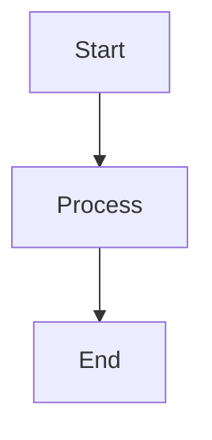

## Context

mdpt 是基于 RustPixel 的 markdown 演示工具，slide 内容通过 `SlideElement` 枚举渲染到 Buffer。当前需要新增 4 种图表元素的解析和字符渲染能力。所有图表均需在终端模式（crossterm）和图形模式（glow/wgpu/sdl/web）下正常工作。

## Goals / Non-Goals

**Goals:**
- 从 markdown 代码块解析图表数据描述，生成对应的字符图形
- 支持折线图、直方图、饼图三种数据图表
- 支持 mermaid 流程图（graph）、序列图（sequenceDiagram）的解析和字符渲染
- 所有图表在终端和图形模式下均可工作（基于 Buffer/Cell 字符渲染）
- 图表尺寸自适应 slide 可用宽度

**Non-Goals:**
- 不做像素级 GPU 图表渲染（保持字符图形方式）
- 不支持完整的 mermaid 语法（先支持 graph 和 sequenceDiagram 两种最常用类型）
- 不支持交互式图表（图表是静态渲染的）
- 不做动画图表（但未来可扩展）

## Decisions

### 1. 图表数据格式：YAML-like 简单格式

图表数据在 markdown 中以带特定语言标记的代码块描述：

**折线图:**
````markdown
```linechart
title: Monthly Sales
x: [Jan, Feb, Mar, Apr, May, Jun]
y: [120, 200, 150, 300, 250, 400]
y2: [80, 150, 100, 200, 180, 300]
width: 60
height: 15
```
````

**直方图:**
````markdown
```barchart
title: Language Popularity
labels: [Rust, Python, Go, TypeScript, Java]
values: [85, 92, 70, 88, 75]
width: 50
height: 12
```
````

**饼图:**
````markdown
```piechart
title: Market Share
labels: [Chrome, Firefox, Safari, Edge]
values: [65, 10, 18, 7]
radius: 8
```
````

**Alternatives considered:**
- JSON 格式：过于冗长，不适合手写
- 完整 YAML：需要依赖 yaml 解析器
- 自定义 DSL：学习成本高

**Decision**: 使用简化的 `key: value` 行格式，方括号表示数组。实现简单，手写方便，无需额外依赖。

### 2. 字符渲染技术

**折线图**: 使用 Unicode Braille 字符（⠀⠁⠂⠃...⣿）实现 2x4 子像素分辨率。每个字符 cell 可表示 2×4 个点，一行 80 个字符即可提供 160×4 的点阵分辨率。坐标轴用 Box Drawing 字符（─│┌┐└┘）绘制。

**直方图**: 使用 Block Elements 字符（▁▂▃▄▅▆▇█）实现 1/8 高度精度的垂直柱状图。每个字符 cell 8 级精度，高度 12 行即可表示 96 级数值差异。水平柱状图使用左半/右半 block（▏▎▍▌▋▊▉█）。

**饼图**: 使用 Braille 字符在二维点阵上绘制圆形。通过极坐标计算每个点的扇区归属，用不同颜色区分扇区。图例以文本形式列在右侧。

**Mermaid**: 节点渲染为 Box Drawing 矩形框，边用 ASCII 线条（─│→）连接。自动布局使用简单的层次布局算法（Sugiyama-like 简化版）。

**Alternatives considered:**
- 纯 ASCII 字符（+|-/\）：分辨率太低
- 自定义图形精灵（Sprite）：只在图形模式可用，终端不支持
- 外部图表库（plotters-rs）：引入重量级依赖

**Decision**: 使用 Unicode Braille + Block Elements，兼顾分辨率和兼容性。

### 3. 模块组织

```
apps/mdpt/src/
├── chart/
│   ├── mod.rs          # Chart trait, 公共类型, 解析入口
│   ├── line_chart.rs   # 折线图渲染
│   ├── bar_chart.rs    # 直方图渲染
│   ├── pie_chart.rs    # 饼图渲染
│   ├── braille.rs      # Braille 点阵工具函数
│   └── mermaid.rs      # Mermaid graph 最小子集 (解析+布局+渲染)
├── slide.rs            # 新增 SlideElement 变体
└── slide_builder.rs    # 新增图表渲染调用
```

**Chart trait:**
```rust
pub trait ChartRenderer {
    /// 解析代码块文本为图表数据
    fn parse(content: &str) -> Result<Self, String> where Self: Sized;
    /// 渲染到 Buffer 的指定区域
    fn render(&self, buf: &mut Buffer, x: u16, y: u16, w: u16, h: u16, colors: &[Color]);
}
```

### 4. 颜色方案

图表使用预定义的 8 色循环调色板，与 mdpt 现有配色风格一致：

```rust
const CHART_COLORS: [Color; 8] = [
    Color::LightRed,
    Color::LightGreen,
    Color::LightBlue,
    Color::LightYellow,
    Color::LightMagenta,
    Color::LightCyan,
    Color::Indexed(208),  // Orange
    Color::Indexed(141),  // Purple
];
```

多条折线或多个扇区自动轮换颜色。

### 5. Mermaid 最小子集

只实现最基本的 mermaid 流程图，不追求完整语法覆盖。先跑通核心链路，后续按需扩展。

**仅支持 `graph TD` / `graph LR`（有向流程图）:**



**支持的语法元素（最小集）:**
- 节点定义: `A[text]`（矩形）
- 边: `A --> B`（有向连线）
- 边标签: `A -->|label| B`（可选）
- 方向: `TD`（上下）、`LR`（左右）

**不支持（降级为代码块显示）:**
- sequenceDiagram、classDiagram、stateDiagram 等其他图表类型
- 菱形 `{text}`、圆形 `(text)` 等特殊节点形状（统一用矩形）
- 子图 `subgraph`
- 样式 `style`、`classDef`

**布局**: 简单的层次布局（拓扑排序分层 + 同层均匀分布），不做交叉最小化优化。

**渲染**:
- 节点: Box Drawing 矩形 `┌─┐│ │└─┘`
- 垂直边: `│` + `↓`
- 水平边: `─` + `→`
- 标签: 显示在边中点

## Risks / Trade-offs

1. **Braille 字符兼容性** → 某些终端不支持 Braille 字符。Mitigation: 提供 ASCII fallback 选项。
2. **Mermaid 解析复杂度** → 完整 mermaid 语法非常复杂。Mitigation: 只支持 graph TD/LR 最小子集，其他所有类型降级为代码块。
3. **饼图圆形精度** → 字符圆形在小半径时失真。Mitigation: 设置最小半径为 6，并使用 Braille 2x4 子像素提高精度。

## Open Questions

1. 是否需要支持图表标题样式自定义（颜色、粗体等）？
2. 折线图是否需要支持多种线型（实线、虚线、点线）？
