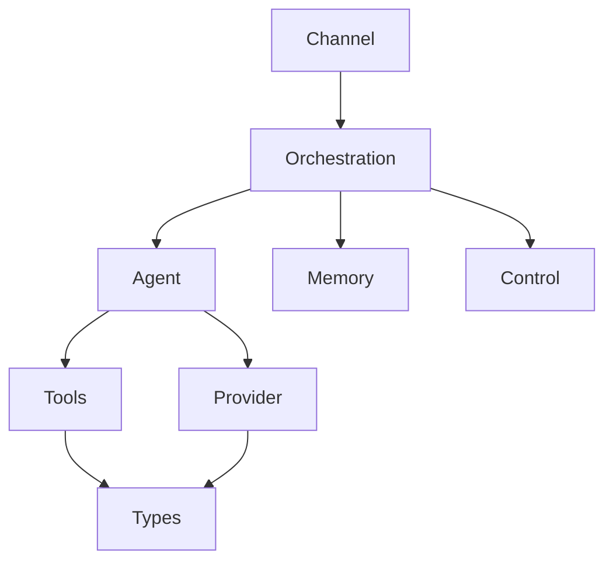
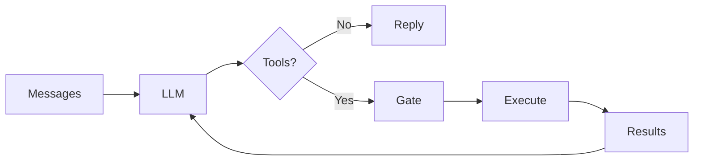
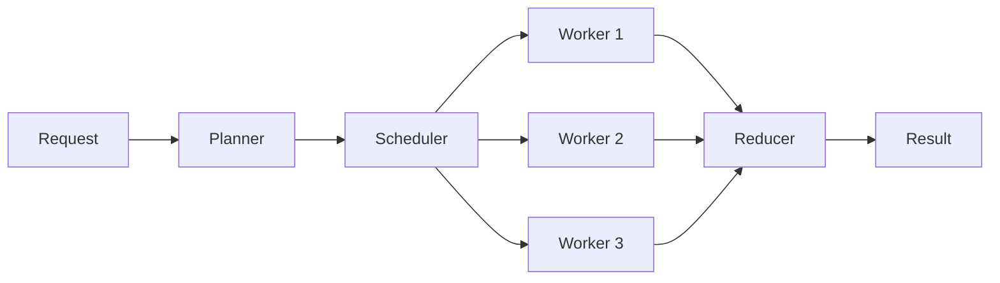
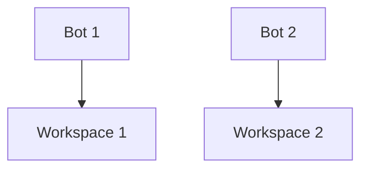
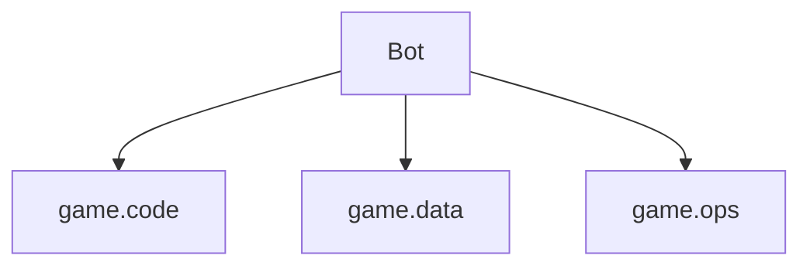
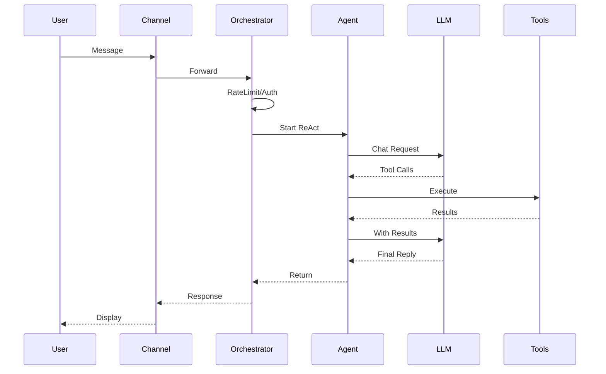

# TyClaw.rs

企业级 AI Agent 框架 — Rust 重写版

服务游戏研发团队的智能助手引擎

---

## 目录

1. 项目概览与核心能力
2. 整体架构设计（9 Crate 分层）
3. 入口与配置系统
4. 14 步编排流水线
5. ReAct 循环引擎深度剖析
6. LLM Provider 抽象与 SSE 流式
7. 工具系统设计
8. Token 预算与上下文压缩
9. 案例记忆与检索
10. 执行安全与 RBAC
11. 多模型支持
12. 部署模式与展望

---

## 项目概览

> TyClaw.rs 是一个企业级 AI Agent 框架，
> 采用 Rust 重写，实现 ReAct 循环引擎。

<!-- pause -->

### 核心能力

* **数据分析** — Excel/CSV 处理、LTV 建模、指标计算
* **问题诊断** — 日志分析、错误调试、服务器问题定位
* **编程辅助** — 脚本编写、代码审查、配置审计
* **流程自动化** — 技能创建、工作流自动化

---

## 为什么用 Rust 重写？

<!-- column_layout: [1, 1] -->
<!-- column: 0 -->

### Python 版痛点

* GIL 限制并发能力
* 内存占用大
* 部署依赖复杂
* 类型安全靠人工

<!-- column: 1 -->

### Rust 版优势

* 零成本异步 (tokio)
* 内存安全无 GC
* 单二进制部署
* 编译期类型检查

<!-- reset_layout -->

<!-- pause -->

> 编译优化：opt-level="z" + LTO fat + strip → 极小部署体积

---

## 整体架构



---

## 9 个 Crate 职责一览

| Crate | 职责 | 核心模块 |
|:------|:-----|:---------|
| tyclaw-app | CLI 入口 | main.rs |
| tyclaw-channel | 通信接入 | CLI / 钉钉 |
| tyclaw-orchestration | 编排流水线 | orchestrator.rs |
| tyclaw-agent | ReAct 引擎 | agent_loop.rs |
| tyclaw-provider | LLM 抽象 | openai_compat.rs |
| tyclaw-tools | 工具注册执行 | registry.rs |
| tyclaw-memory | 案例记忆 | case_store.rs |
| tyclaw-control | 安全控制 | gate.rs / rbac.rs |
| tyclaw-types | 共享类型 | message.rs |

---

## 入口：main.rs 启动流程

```rust {1-5|7-12|14-18|all} +line_numbers
// 配置优先级：命令行参数 > 环境变量 > config.yaml > 默认值
let args = Args::parse();
let config_path = args.config
    .unwrap_or_else(|| args.workspace.join("config/config.yaml"));
let cfg = load_config(&config_path);

// 创建 LLM 提供者（Arc 共享给 Orchestrator 和 AgentLoop）
let thinking = if cfg.llm.thinking_enabled {
    Some(ThinkingConfig {
        effort: cfg.llm.thinking_effort.clone(),
        budget_tokens: cfg.llm.thinking_budget_tokens,
    })
} else { None };

let provider: Arc<dyn LLMProvider> =
    Arc::new(OpenAICompatProvider::new(
        &api_key, &api_base, &model, thinking
    ));
```

---

## 配置文件结构

```rust +line_numbers
#[derive(Debug, Default, Deserialize)]
struct ConfigFile {
    llm: LlmConfig,              // LLM 相关
    dingtalk: DingTalkConfig,     // 钉钉相关
    workspaces: HashMap<String, WorkspaceConfig>,
    logging: LoggingConfig,       // 日志配置
    multi_model: MultiModelConfig, // 多模型编排
}

#[derive(Debug, Default, Deserialize)]
struct LlmConfig {
    api_key: Option<String>,
    api_base: Option<String>,
    model: Option<String>,
    max_iterations: usize,         // 默认 40
    thinking_enabled: bool,        // Extended Thinking
    thinking_effort: String,       // none/low/medium/high
    thinking_budget_tokens: Option<u32>,
}
```

---

## 双模式运行：CLI vs 钉钉

```rust +line_numbers
if args.dingtalk {
    // 钉钉 Stream 模式：WebSocket 长连接
    let bot = DingTalkBot::new(
        orchestrator, token_manager,
        &client_id, workspace_id, routes,
    );
    let stream_client = DingTalkStreamClient::new(credential);
    stream_client.register_handler(
        ChatbotMessage::TOPIC,
        bot as Arc<dyn ChatbotHandler>,
    ).await;
    stream_client.start_forever().await;
} else {
    // CLI 模式：交互式 REPL
    let cli = CliChannel::new("cli_user", "default");
    cli.run(&mut orchestrator).await;
}
```

---

## CLI 交互循环

```rust {1-5|7-14|all} +line_numbers
// 基于 rustyline 的 REPL
let mut rl = DefaultEditor::new()?;
loop {
    let input = rl.readline("You> ")?;
    let trimmed = input.trim();

    // CLI 进度回调
    let progress_cb: OnProgress = Box::new(|msg: &str| {
        let msg = msg.to_string();
        Box::pin(async move {
            println!("[进度] {}", msg);
        })
    });

    // 调用编排器处理
    let result = orchestrator.handle(
        trimmed, &user_id, &workspace_id,
        "cli", "direct", Some(&progress_cb),
    ).await?;
}
```

---

## Channel 层 — 多通道接入

<!-- column_layout: [1, 1] -->
<!-- column: 0 -->

### CLI 通道

* stdin/stdout 交互
* rustyline 行编辑 + 历史
* 本地开发调试

<!-- column: 1 -->

### 钉钉通道

* WebSocket Stream 长连接
* conversation_id → workspace_id 路由
* TokenManager 自动刷新

<!-- reset_layout -->

<!-- pause -->

> [!note]
> 通过 ChatbotHandler trait 抽象，可扩展 Slack、飞书等新通道

---

## 14 步编排流水线（上）

```barchart
title: 流水线各步骤（前7步）
labels: [限流, 认证, 会话, 指令, 预检, 技能, 案例]
values: [1, 1, 2, 1, 2, 3, 3]
height: 10
```

<!-- pause -->

1. **限流** — 滑动窗口，per-user + 全局
2. **认证** — 角色查找 (admin/user/viewer)
3. **会话管理** — workspace_id:channel:chat_id
4. **Slash 指令** — /new, /save, /memory-dump
5. **预合并检查** — Token 预算 50% 阈值
6. **技能收集** — builtin + personal skills
7. **案例检索** — 关键词匹配历史案例

---

## 14 步编排流水线（下）

8. **消息组装** — System prompt + 历史 + 当前消息
9. **ReAct 循环** — 核心推理与工具调用
10. **会话持久化** — JSONL 格式保存
11. **后合并检查** — 再次检查 Token 预算
12. **用量追踪** — 记录消耗供下轮限流
13. **审计日志** — 写入 audit.jsonl
14. **案例抽取** — 自动提取已解决问题

<!-- pause -->

> [!note]
> 每一步都有对应的功能开关（OrchestratorFeatures）

---

## 编排器核心：handle 方法

```rust {1-6|8-14|16-23|all} +line_numbers
pub async fn handle_with_context(
    &mut self, user_message: &str,
    req: &RequestContext,
    on_progress: Option<&OnProgress>,
) -> Result<AgentResponse, TyclawError> {
    let start = Instant::now();

    // 1. 速率限制检查
    if self.features.enable_rate_limit {
        self.rate_limiter.check(user_id)
            .map_err(TyclawError::RateLimitExceeded)?;
    }
    // 2. 获取用户角色
    let user_role = self.workspace_mgr
        .get_user_role(workspace_id, user_id);

    // 3-8. 会话/技能/案例/消息组装 ...

    // 9. 运行 ReAct 循环引擎
    let result: RuntimeResult = self.runtime
        .run(final_messages, &user_role, on_progress)
        .await?;
    // 10-14. 持久化/审计/案例抽取 ...
}
```

---

## 编排器数据结构

```rust +line_numbers
pub struct Orchestrator {
    workspace: PathBuf,
    model: String,
    provider: Arc<dyn LLMProvider>,
    runtime: Box<dyn AgentRuntime>,      // ReAct 引擎
    workspace_mgr: WorkspaceManager,     // RBAC
    audit: AuditLog,                     // 审计
    case_store: CaseStore,               // 案例库
    context: ContextBuilder,             // 上下文构建
    sessions: SessionManager,            // 会话 JSONL
    skills: SkillManager,                // 技能发现
    consolidator: MemoryConsolidator,    // 记忆合并
    rate_limiter: RateLimiter,           // 限流
    features: OrchestratorFeatures,      // 功能开关
    context_window_tokens: usize,        // Token 预算
    pending_files: Arc<Mutex<Vec<String>>>,
}
```

---

## ReAct 循环引擎概览



---

## AgentLoop 结构体

```rust +line_numbers
pub struct AgentLoop {
    provider: Arc<dyn LLMProvider>,
    tools: ToolRegistry,
    context: ContextBuilder,
    gate: ExecutionGate,          // RBAC 门禁
    model: Option<String>,
    max_iterations: usize,        // 默认 25
    write_snapshot: bool,         // 调试快照
}

#[async_trait]
impl AgentRuntime for AgentLoop {
    async fn run(
        &self,
        initial_messages: Vec<HashMap<String, Value>>,
        user_role: &str,
        on_progress: Option<&OnProgress>,
    ) -> Result<RuntimeResult, TyclawError> {
        // ... ReAct 主循环
    }
}
```

---

## ReAct 主循环核心

```rust {1-8|10-19|all} +line_numbers
loop {
    total_iterations += 1;
    if total_iterations > self.max_iterations * 2 {
        warn!("Absolute max iterations reached");
        break;
    }
    let phase = if in_exploration { "explore" }
                else { "produce" };

    // 压缩旧工具结果 + 注入状态快照
    maybe_compact_system_message(&mut messages, total_iterations);
    maybe_compact_assistant_history(&mut messages);
    let compressed = compress_tool_results(
        &messages, skip_compression,
        LIGHT_COMPRESS_RECENT_ROUNDS,
    );

    // 调用 LLM
    let response = self.provider.chat_with_retry(
        compressed, Some(tool_defs.clone()),
        self.model.clone(),
    ).await;
    // ... 工具执行与循环控制
}
```

---

## 阶段追踪机制

<!-- anim: fadein -->
Explore → Investigate → Execute → Summarize → Conclude

<!-- pause -->

| 阶段 | 目的 | 典型操作 |
|:-----|:-----|:---------|
| Explore | 理解问题 | 读文件、列目录 |
| Investigate | 深入分析 | grep、分析日志 |
| Execute | 执行方案 | 编辑文件、运行命令 |
| Summarize | 汇总结果 | 整理输出 |
| Conclude | 给出答案 | 最终回复用户 |

<!-- pause -->

> 产出型工具（write_file/edit_file）首次出现 → 自动切出探索阶段

---

## 关键常量：防护与预算

```rust +line_numbers
// 重复检测
const MAX_REPEAT_TOOL_BATCH: usize = 3;   // 连续重复批次上限
const MAX_NO_PROGRESS_ROUNDS: usize = 2;  // 无进展轮次上限

// 工具输出截断
const MAX_TOOL_OUTPUT_CHARS: usize = 4000;         // 产出阶段
const MAX_TOOL_OUTPUT_CHARS_EXPLORE: usize = 3500;  // 探索阶段

// 探索预算
const EXPLORE_MAX_RATIO_PERCENT: usize = 30;  // 占总轮次 30%
const EXPLORE_ABSOLUTE_CAP: usize = 10;       // 绝对上限 10 轮

// 产出阶段防抖
const MAX_CONSECUTIVE_EXEC_IN_PRODUCE: usize = 5;
const PRODUCTION_TOOLS: &[&str] =
    &["write_file", "edit_file", "send_file"];
```

---

## LLM Provider Trait

```rust +line_numbers
#[async_trait]
pub trait LLMProvider: Send + Sync {
    /// 核心方法：发送聊天请求
    async fn chat(&self, request: ChatRequest)
        -> Result<LLMResponse, TyclawError>;

    fn default_model(&self) -> &str;
    fn api_base(&self) -> String;
    fn generation_settings(&self) -> GenerationSettings;

    /// 带指数退避重试（1s → 2s → 4s）
    async fn chat_with_retry(
        &self,
        messages: Vec<HashMap<String, Value>>,
        tools: Option<Vec<Value>>,
        model: Option<String>,
    ) -> LLMResponse { /* ... */ }
}

// 临时性错误判断
const TRANSIENT_MARKERS: &[&str] = &[
    "429", "rate limit", "500", "502", "503",
    "overloaded", "timeout", "connection",
];
```

---

## OpenAI 兼容 Provider

```rust {1-10|12-20|all} +line_numbers
pub struct OpenAICompatProvider {
    client: Client,              // reqwest HTTP 客户端
    api_key: String,
    api_base: String,
    default_model: String,
    generation: GenerationSettings,
}

impl OpenAICompatProvider {
    pub fn new(api_key: &str, api_base: &str,
               default_model: &str,
               thinking: Option<ThinkingConfig>) -> Self {
        let client = Client::builder()
            .http1_only()        // 避免 HTTP/2 SSE 问题
            .pool_max_idle_per_host(0) // 每次新建连接
            .connect_timeout(Duration::from_secs(10))
            .tcp_keepalive(Duration::from_secs(15))
            .build()
            .unwrap_or_else(|_| Client::new());
        // ...
    }
}
```

---

## SSE 流式请求

```rust +line_numbers
async fn chat_stream(&self, request: ChatRequest)
    -> Result<LLMResponse, TyclawError>
{
    let mut body = self.build_body(&request);
    body["stream"] = json!(true);

    // 带重试的 HTTP 请求（最多 3 次）
    for attempt in 1..=3u32 {
        let send_fut = self.client.post(&endpoint)
            .header("Authorization", &auth)
            .header("Accept", "text/event-stream")
            .json(&body).send();
        let result = tokio::time::timeout(
            Duration::from_secs(60), send_fut
        ).await;
        // ... 重试逻辑
    }

    // 逐 chunk 读取 SSE 事件流
    loop {
        let chunk = tokio::time::timeout(
            Duration::from_secs(90), // chunk 间隔超时
            stream.next(),
        ).await;
        // 累积 delta: content, tool_calls, reasoning
    }
}
```

---

## JSON 修复与响应解析

```rust +line_numbers
fn parse_response(&self, data: Value) -> Result<LLMResponse, _> {
    let choice = data.get("choices").and_then(|c| c.get(0))?;
    let message = choice.get("message")?;

    // 解析工具调用
    let mut tool_calls = Vec::new();
    if let Some(Value::Array(tcs)) = message.get("tool_calls") {
        for tc in tcs {
            let args_str = func.get("arguments")
                .and_then(|v| v.as_str())
                .unwrap_or("{}");
            // json_repair 处理 LLM 可能输出的畸形 JSON
            let arguments: HashMap<String, Value> =
                json_repair::repair_json(args_str)
                    .ok()
                    .and_then(|v| serde_json::from_value(v).ok())
                    .unwrap_or_default();
            tool_calls.push(ToolCallRequest { id, name, arguments });
        }
    }
    // 提取 reasoning_content（DeepSeek/Claude thinking）
    let reasoning = message.get("reasoning_content")
        .or_else(|| message.get("reasoning"));
}
```

---

## Tool Trait 定义

```rust +line_numbers
#[derive(Debug, Clone, Copy, PartialEq, Eq)]
pub enum RiskLevel {
    Read,       // 只读 — 所有角色
    Write,      // 写入 — Member 及以上
    Dangerous,  // 危险 — Admin 确认
}

#[async_trait]
pub trait Tool: Send + Sync {
    fn name(&self) -> &str;
    fn description(&self) -> &str;
    fn parameters(&self) -> Value;  // JSON Schema

    fn risk_level(&self) -> RiskLevel {
        RiskLevel::Read  // 默认只读
    }

    async fn execute(
        &self, params: HashMap<String, Value>
    ) -> String;
}
```

---

## 工具注册表

```rust +line_numbers
pub struct ToolRegistry {
    tools: HashMap<String, Box<dyn Tool>>,
}

impl ToolRegistry {
    pub fn register(&mut self, tool: Box<dyn Tool>) {
        self.tools.insert(tool.name().to_string(), tool);
    }

    /// 生成 OpenAI function calling 格式定义
    pub fn get_definitions(&self) -> Vec<Value> {
        self.tools.values().map(|tool| {
            json!({
                "type": "function",
                "function": {
                    "name": tool.name(),
                    "description": tool.description(),
                    "parameters": tool.parameters(),
                }
            })
        }).collect()
    }

    /// 执行工具：查找 → 类型转换 → 验证 → 执行
    pub async fn execute(&self, name: &str,
        mut params: HashMap<String, Value>) -> String {
        let tool = self.tools.get(name)?;
        base::cast_params(&mut params, &tool.parameters());
        tool.execute(params).await
    }
}
```

---

## 工具系统

<!-- column_layout: [1, 1] -->
<!-- column: 0 -->

### 内置工具

* `read_file` — 读取文件
* `write_file` — 写入文件
* `edit_file` — 编辑文件
* `exec` — 执行命令
* `ask_user` — 询问用户
* `send_file` — 发送文件
* `list_dir` — 列出目录

<!-- column: 1 -->

### FileOps 工具

* `copy` — 复制文件
* `move` — 移动文件
* `mkdir` — 创建目录
* `grep` — 内容搜索
* `find` — 文件查找

<!-- reset_layout -->

<!-- pause -->

> [!note]
> 工具注册时标记风险等级，运行时由 ExecutionGate 拦截检查

---

## 参数类型自动修正

```rust +line_numbers
/// LLM 有时把数字/布尔值以字符串传递，
/// 此函数根据 JSON Schema 自动转换类型
pub fn cast_params(
    params: &mut HashMap<String, Value>,
    schema: &Value,
) {
    let props = schema.get("properties")?;
    for (key, prop_schema) in props {
        let expected_type = prop_schema.get("type")?;
        let value = params.get(key)?;

        let casted = match expected_type {
            "integer" => match &value {
                Value::String(s) => s.parse::<i64>().ok()
                    .map(Value::from),       // "42" → 42
                Value::Number(n) => n.as_f64()
                    .map(|f| Value::from(f as i64)),
                _ => None,
            },
            "boolean" => match &value {
                Value::String(s) =>
                    Some(Value::Bool(
                        matches!(s.as_str(), "true"|"1"|"yes")
                    )),
                _ => None,
            },
            // ...
        };
    }
}
```

---

## Token 预算管理

```linechart
title: 上下文窗口分配示意 (%)
x: [System, History, Skills, Cases, Current, Reserved]
y: [15, 50, 10, 5, 15, 5]
height: 10
```

<!-- pause -->

```rust +line_numbers
const HISTORY_BUDGET_RATIO: usize = 45;      // 基础占比
const MAX_HISTORY_BUDGET_RATIO: usize = 65;   // 动态上限
const MAX_HISTORY_TOKENS_HARD_LIMIT: usize = 49_152;
const MIN_HISTORY_BUDGET_TOKENS: usize = 256;
const MAX_INJECTED_SKILLS: usize = 8;
const MAX_SIMILAR_CASES_CHARS: usize = 2500;
// 首轮加成
const FIRST_TURN_SKILL_BONUS: usize = 2;
const FIRST_TURN_CASES_CHARS_BONUS: usize = 1200;
```

---

## 消息压缩：三层衰减策略

```rust +line_numbers
// 工具结果衰减
const TOOL_RESULT_FRESH_COUNT: usize = 8;   // 最近 8 条完整
const TOOL_RESULT_MEDIUM_CHARS: usize = 700; // 中间截断
const TOOL_RESULT_OLD_COUNT: usize = 20;     // 更早只保留摘要

// Assistant 文本压缩
const ASSISTANT_TEXT_LIGHT_KEEP: usize = 5;      // 近 5 条
const ASSISTANT_TEXT_COMPACT_THRESHOLD: usize = 700;
const ASSISTANT_TEXT_KEEP_PREFIX: usize = 180;    // 重压缩
const ASSISTANT_TEXT_KEEP_SUFFIX: usize = 100;

// tool_call arguments 衰减
const TOOL_CALL_ARGS_FRESH_COUNT: usize = 4;
const TOOL_CALL_ARGS_MEDIUM_CHARS: usize = 520;
const TOOL_CALL_ARGS_OLD_COUNT: usize = 10;
```

---

## 压缩实现：轻/重两级

```rust +line_numbers
/// 轻压缩：截断到 700 chars
fn compact_assistant_light(content: &str) -> String {
    let total = content.chars().count();
    if total <= ASSISTANT_TEXT_COMPACT_THRESHOLD {
        return content.to_string();
    }
    let truncated = truncate_by_chars_local(
        content, ASSISTANT_TEXT_COMPACT_THRESHOLD
    );
    format!("{truncated}\n... [omitted {} chars]",
        total - ASSISTANT_TEXT_COMPACT_THRESHOLD)
}

/// 重压缩：保留前 180 + 后 100 chars
fn compact_assistant_heavy(content: &str) -> String {
    let prefix = truncate_by_chars_local(
        content, ASSISTANT_TEXT_KEEP_PREFIX);
    let suffix: String = content.chars()
        .skip(total.saturating_sub(ASSISTANT_TEXT_KEEP_SUFFIX))
        .collect();
    format!("{prefix}\n... [omitted {} chars]\n{suffix}",
        total - KEEP_PREFIX - KEEP_SUFFIX)
}
```

---

## Exec 意图摘要提取

```rust +line_numbers
/// 对旧 exec 命令提取意图摘要：
/// 保留注释行(#)、print()、import 语句
fn extract_exec_intent(
    args_str: &str, max_chars: usize
) -> Option<String> {
    let cmd = extract_json_field(args_str, "command")?;
    let mut intent_lines: Vec<&str> = Vec::new();

    for line in cmd.lines() {
        let trimmed = line.trim();
        if trimmed.starts_with('#')
            || trimmed.starts_with("print(")
            || trimmed.starts_with("import ")
            || trimmed.starts_with("from ")
        {
            intent_lines.push(trimmed);
        }
    }
    let intent = intent_lines.join(" | ");
    Some(json!({
        "command": format!(
            "[python ({} chars) intent: {intent}]",
            cmd.len()
        )
    }).to_string())
}
```

---

## 内联 Python 脚本提取

```rust +line_numbers
/// 将 `python3 -c "..."` 转为临时文件执行
fn extract_inline_script(cmd: &str) -> Option<String> {
    let caps = INLINE_PY_RE.captures(cmd.trim())?;
    let prefix = caps.get(1).map(|m| m.as_str())
        .unwrap_or("");
    let script = caps.get(2).or_else(|| caps.get(3))?;

    // 反转义
    let script = script.replace("\\n", "\n")
        .replace("\\t", "\t")
        .replace("\\\"", "\"");

    // 写入临时文件
    let timestamp = SystemTime::now()
        .duration_since(UNIX_EPOCH)?.as_millis();
    let tmp = format!("/tmp/_tyclaw_inline_{timestamp}.py");
    std::fs::write(&tmp, &script).ok()?;

    Some(format!(
        "{prefix}python3 {tmp} ; rm -f {tmp}"
    ))
}
```

> 超过 2000 字符的内联脚本自动提取到临时文件

---

## 案例记忆系统

```rust +line_numbers
#[derive(Debug, Clone, Serialize, Deserialize)]
pub struct CaseRecord {
    pub case_id: String,       // UUID 前 12 位
    pub question: String,      // 原始问题
    pub workspace_id: String,  // 多租户隔离
    pub timestamp: String,     // RFC 3339
    pub category: String,      // 如 "build_error"
    pub root_cause: String,    // 根因分析
    pub solution: String,      // 解决方案
    pub evidence: Vec<String>, // 证据片段
    pub modules: Vec<String>,  // 涉及模块
    pub tools_used: Vec<String>,
    pub duration_seconds: f64,
}

pub struct CaseStore {
    cases_dir: PathBuf,  // <cases_dir>/<workspace>/cases.json
}
```

---

## 案例检索：关键词 + 时间衰减

```rust +line_numbers
/// 评分公式：score = keyword_score × time_decay
/// - keyword_score: 交集数 / 查询词总数
/// - time_decay: exp(-0.693 × age_days / 30)
const HALF_LIFE_DAYS: f64 = 30.0;

fn time_decay(timestamp: &str) -> f64 {
    let ts = DateTime::parse_from_rfc3339(timestamp)?;
    let age_days = (now - ts).num_seconds() as f64 / 86400.0;
    (-0.693 * age_days / HALF_LIFE_DAYS).exp()
}

/// 分词器：ASCII 小写 + CJK 连续序列
fn tokenize(text: &str) -> HashSet<String> {
    let mut tokens = HashSet::new();
    for m in ASCII_WORD_RE.find_iter(text) {
        tokens.insert(m.as_str().to_lowercase());
    }
    for m in CJK_RUN_RE.find_iter(text) {
        tokens.insert(m.as_str().to_string());
    }
    tokens
}
```

---

## 执行门禁：RBAC 权限判定

```rust +line_numbers
pub enum JudgmentAction {
    Allow,    // 允许
    Deny,     // 拒绝
    Confirm,  // 需确认（危险操作）
}

impl ExecutionGate {
    pub fn judge(&self, _tool_name: &str,
        _tool_args: &Value, risk_level: &str,
        user_role: &str,
    ) -> Judgment {
        // 规则1: 只读工具始终允许
        if risk_level == "read" {
            return Judgment { action: Allow, .. };
        }
        // 规则2: 角色权限不足 → 拒绝
        if !self.rbac.is_risk_level_allowed(
            user_role, risk_level) {
            return Judgment { action: Deny, .. };
        }
        // 规则3: dangerous → Admin Confirm, 其他 Deny
        if risk_level == "dangerous" {
            if self.rbac.is_role_at_least(user_role, "admin")
                { return Judgment { action: Confirm, .. }; }
            else { return Judgment { action: Deny, .. }; }
        }
        // 规则4: 默认允许
        Judgment { action: Allow, .. }
    }
}
```

---

## 速率限制器

```rust +line_numbers
struct SlidingWindow {
    timestamps: VecDeque<Instant>,
    max_requests: usize,
    window: Duration,
}

impl SlidingWindow {
    fn prune_and_count(&mut self) -> usize {
        let cutoff = Instant::now() - self.window;
        while self.timestamps.front()
            .map_or(false, |t| *t < cutoff) {
            self.timestamps.pop_front();
        }
        self.timestamps.len()
    }

    fn check(&mut self) -> bool {
        self.prune_and_count() < self.max_requests
    }
}

pub struct RateLimiter {
    per_user: Mutex<HashMap<String, SlidingWindow>>,
    global: Mutex<SlidingWindow>,
}
```

---

## 多模型支持



<!-- pause -->

* **Planner** — 任务分解与规划
* **Scheduler** — 子任务分发与并行调度
* **Reducer** — 结果聚合与整合
* 支持不同 Provider 混合调用（routing_rules）

---

## 技术栈一览

| 领域 | 技术选型 | 用途 |
|:-----|:---------|:-----|
| 异步运行时 | tokio 1.x | 多线程异步 |
| HTTP 客户端 | reqwest 0.12 | LLM API (SSE) |
| Token 估算 | tiktoken-rs 0.9 | 上下文管理 |
| 结构化日志 | tracing | 可观测性 |
| CLI 解析 | clap 4 | 命令行参数 |
| WebSocket | tokio-tungstenite | 钉钉接入 |
| 序列化 | serde + serde_json | JSON/YAML |
| 哈希 | sha2 | 案例存储 |
| 正则 | regex | 模式匹配 |

---

## 编译优化配置

```toml +line_numbers
[profile.release]
opt-level = "z"        # 最小体积优化
lto = "fat"            # 全量链接时优化
codegen-units = 1      # 单代码生成单元
strip = true           # 剥离调试符号
panic = "abort"        # panic 直接终止
```

<!-- pause -->

> 单二进制部署，体积小、启动快、无运行时依赖

---

## 部署模式

<!-- column_layout: [1, 1] -->
<!-- column: 0 -->

### Mode A: 严格隔离

* 1 workspace = 1 bot = 1 process
* 各进程独立运行
* 适合小规模团队



<!-- column: 1 -->

### Mode B: 团队整合

* 1 team = 1 process
* 多 workspace 共享进程
* 钉钉路由分发



<!-- reset_layout -->

---

## 关键数据流



---

## 项目规模

```piechart
title: 代码分布（按 crate）
labels: [Orchestration, Agent, Provider, Tools, Control, Memory, Channel, Types, App]
values: [30, 25, 15, 12, 8, 5, 3, 1, 1]
radius: 20
```

---

## 设计模式总结

* **Trait 抽象** — LLMProvider, Tool, AgentRuntime
* **Builder 模式** — OrchestratorBuilder 流式构建
* **状态机** — Agent 阶段追踪 (Explore/Execute)
* **消息去重** — 避免重复工具调用（batch signature）
* **懒加载** — 技能与案例按需加载
* **热重载** — Bootstrap .md 文件监控 mtime

<!-- pause -->

> 每一个设计决策都在追求：
> **安全、高效、可扩展**

---

## 未来展望

* **更多通道接入** — Slack、飞书、企业微信
* **插件化工具** — 动态加载第三方工具
* **分布式部署** — 多节点水平扩展
* **知识图谱** — 结构化知识存储与推理
* **可视化监控** — 实时 Agent 状态面板

<!-- pause -->

> [!note]
> 核心目标：让每个游戏研发团队都拥有自己的 AI 助手

---

<!-- jump_to_middle -->

# Thank You!

TyClaw.rs — 用 Rust 构建可靠的 AI Agent

Q & A
